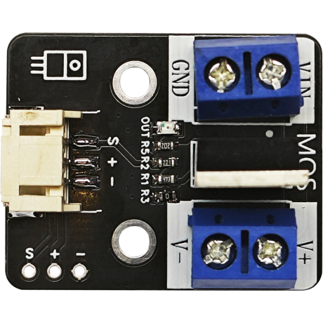
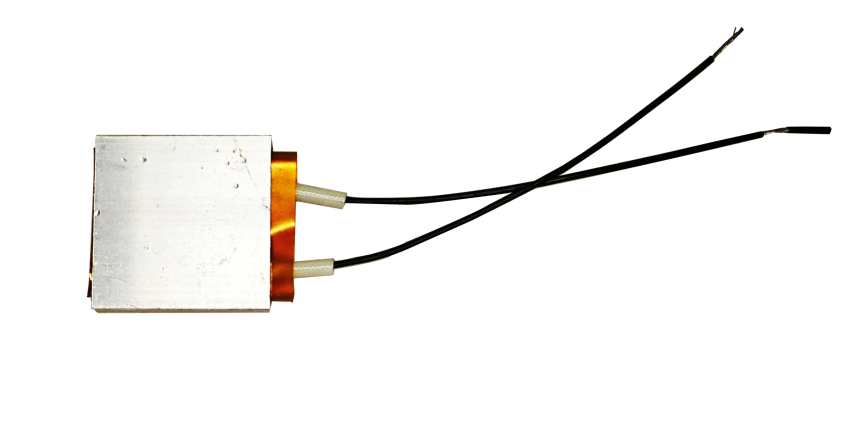

# 第八章 智能温控系统

## 1、简介

在这个实验中，我们将使用Arduino uno R3主板、SHT30温湿度传感器、加热模块、9g舵机、电机风扇模块来制作一个智能温控系统。加热模块通过MOS管模块控制开关。通过感应环境温度的高低控制加热器、门和风扇的开关。实现当温度过高时，开启电机风扇模块、打开门降温，当温度过低时，开启加热模块并自动关闭门进行加热升温。

## 2、课程目标

+ 了解电机风扇模块的工作原理及应用；

+ 了解MOS管模块的使用；

+ 解180度9g舵机的基本原理和使用方法；

+ 学习并应用Arduino IDE编程，完成根据获取温度的数值自动开启/关闭加热模块或风扇的编程；

+ 实现电子电路的基本搭建。

## 3、器材准备

+ Arduino UNO主控板*1

+ 传感器扩展板*1

+ 电机风扇模块*1v

+ 扇叶*1

+ SHT30温湿度模块*1

+ 加热模块*1

+ MOS管模块*1

+ 180度9g舵机

+ 杜邦线*3

+ USB数据线*1

## 4、电机风扇模块

电机风扇模块包含一个小型的DC电机和一个风扇叶片。在Arduino项目中，你可以通过控制电机的电源来打开或关闭风扇。


## 5、MOS管模块

用来连接加热器，通过控制MOS管的开关来控制加热器是否导电。



## 6、加热模块

通过内置的发热片恒温发热，体积小，结构简单，使用方便。



## 7、180度9g舵机

该舵机属于180°微型舵机，采用高强度ABS透明外壳配以内部高精度尼龙齿轮组，加上精准的控制电路、高档轻量化空心杯电机使该微型舵机的重量只有9克，而输出力矩达到了惊人的1.6kg*cm。在代码中，我们将使用舵机库来控制舵机的旋转角度，从而实现自动开门和关门


+ 反应转速：0.12-0.13秒/60度

+ 使用温度：-30~+60°

+ 死区设定：5微秒

+ 转动角度：最大180度

+ 结构材质：塑料齿

**接口说明：**  

+ 棕色：GND

+ 红色：VCC

+ 橙色：信号线

## 8、硬件连接

将加热模块连接在MOS管（红线接V+，黑线接V-）上，MOS管模块用3P杜邦线连接到传感器扩展板的数字接口D10（黄线S—D10，红线VCC—5V，黑线GND—GND）；

电机风扇模块用3P杜邦线连接到传感器扩展板的数字接口D3（黄线S—D3，红线VCC—5V，黑线GND—GND）；

SHT30温湿度传感器4P杜邦线连接到传感器扩展板的IIC接口（蓝线D—SDA，绿线C—SCL,红线VCC—5V，黑线GND—GND）（连第2个IIC接口）；

180度9g舵机连接在传感器扩展板的数字接口D4（黄线S—D4，红线VCC—5V，黑线GND—GND）。

将舵机配的舵盘安装在舵机上，安装舵盘之前舵机需要先复位（先将舵机接在主板的数字接口D4，将程序下载到主板上，舵机就会进行自动复位），安装时门是处于关闭状态。舵机安装在舵机固定件上，将门的拉杆一边连接到舵机的舵盘上，一边连接到门上。通过舵机控制舵盘的角度来控制门的开关。

确保所有连接都正确无误。


## 9、实验程序
将以下程序复制到Arduino IDE中，选择好主板和对应的端口，编译上传程序。
```C
//缺程序
```

## 10、观察现象

将这段代码上传到Arduino UNO R3主板上，当温湿度模块检测到温度过高时，电机风扇模块就会自动打开风扇降温，门也将自动打开通风。当温度过低时，门会自动关闭，MOS管模块就会自动控制加热模块进行加热。