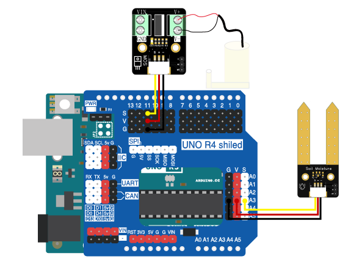

# 第九章 自动灌溉系统

## 1、简介

在这个实验中，我们将使用Arduino uno R3主板、水泵、MOS管模块，土壤湿度传感器来制作一个自动灌溉系统。通过检测土壤的湿度自动进行浇水。

## 2、课程目标

+ 了解水泵的工作原理及应用；

+ 学习并应用Arduino IDE编程，完成根据获取的土壤湿度值自动开启/关闭水泵浇水；

+ 实现电子电路的基本搭建。

## 3、器材准备

+ Arduino UNO主控板*1

+ 传感器扩展板*1

+ 土壤湿度传感器*1

+ MOS管模块*1

+ 水泵*1

+ 杜邦线*2

+ USB数据线*1


## 4、水泵

直流电机3V立式小水泵，导电性好，性能稳定，可以应用于自动化设备水循环，是制冷，饮水机，太阳能喷泉，蓄水池补水等多种用途。


## 5、硬件连接

土壤湿度传感器用3P杜邦线连接到传感器扩展板的模拟接口A3（黄线S—A3，红线VCC—5V，黑线GND—GND）；

将水泵连接在MOS管（红线接V+，黑线接V-）上，MOS管模块用3P杜邦线连接到传感器扩展板的数字接口D11（黄线S—D11，红线VCC—5V，黑线GND—GND）


确保所有连接都正确无误。





## 6、实验程序
将以下程序复制到Arduino IDE中，选择好主板和对应的端口，编译上传程序。
```C 
//缺程序

```
## 7、观察现象

将这段代码上传到Arduino UNO R3主板上，水泵将会根据土壤湿度传感器获取的湿度值判
断是否需要浇水。