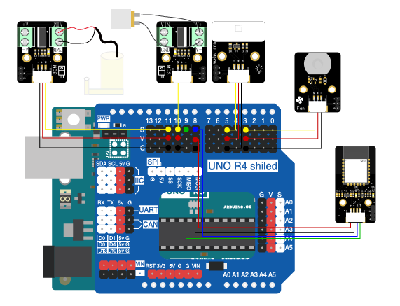
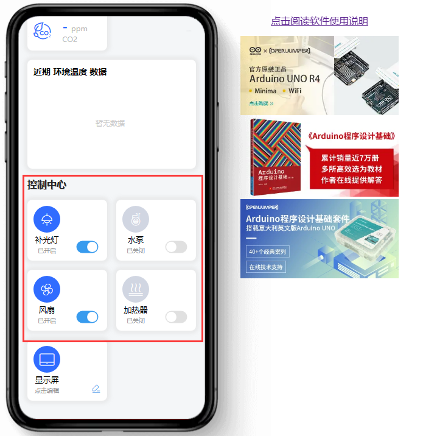

# 第十章 农场环境调节

## 1、简介

在这个实验中，我们使用Arduino uno R3主板、蓝牙模块、高亮LED模块、电机风扇模块，加热器，水泵来实现农场的环境调节。通过使用Arduino和蓝牙模块连接，蓝牙控制端控制高亮LED灯、风扇、加热器、水泵的开关。

## 2、课程目标

+ 学会通过蓝牙控制各个模块的编程；

+ 实现电子电路的连接

## 3、器材准备

+ Arduino UNO主控板*1

+ 传感器扩展板*1

+ 蓝牙模块*1

+ 高亮LED模块*1

+ 电机风扇模块*1

+ 加热模块*1

+ MOS管模块*2

+ 水泵*1

+ 杜邦线*5

+ USB数据线*1


## 4、硬件连接

+ 将高亮LED模块用3P杜邦线连接到传感器扩展板的数字接口D5（黄线S—D5，红线VCC—5V，黑线GND—GND）；

+ 电机风扇模块用3P杜邦线连接到传感器扩展板的数字接口D3（黄线S—D3，红线VCC—5V，黑线GND—GND）；

+ 将加热模块连接在MOS管（红线接V+，黑线接V-）上，MOS管模块用3P杜邦线连接到传感器扩展板的数字接口D10（黄线S—D10，红线VCC—5V，黑线GND—GND）；

+ 将水泵连接在MOS管（红线接V+，黑线接V-）上，MOS管模块用3P杜邦线连接到传感器扩展板的数字接口D11（黄线S—D11，红线VCC—5V，黑线GND—GND）；

+ 蓝牙模块用4P杜邦线连接到传感器扩展板的串口（蓝线RX—D8，绿线TX—D9，红线VCC—5V，黑线GND—GND）

确保所有连接都正确无误。




## 5、实验程序

将以下程序复制到Arduino IDE中，选择好主板和对应的端口，编译上传程序。
```C

#include <SoftwareSerial.h>

SoftwareSerial mySerial(8,9); // RX, TX

#define PIN_FAN 3//风扇
#define PIN_LIGHT 5//灯
#define PIN_HEATER 10//加热器
#define PIN_WATER 11//水泵

void setup() {
  // 初始化串口通信
  Serial.begin(9600);
  mySerial.begin(9600);

  pinMode(PIN_FAN,OUTPUT);
  pinMode(PIN_LIGHT,OUTPUT);
  pinMode(PIN_HEATER,OUTPUT);
  pinMode(PIN_WATER,OUTPUT);
}

void loop() { 
  checkSerial();
}

void checkSerial() {
  String inputString = "";
  if (mySerial.available() > 0) {
    inputString = mySerial.readStringUntil('\n');
    inputString.trim();//去除前导和后置空格
    int colonIndex = inputString.indexOf(':');//在另一个String中定位一个字符或String。默认情况下，搜索从String的开头开始，但也可以从给定的索引开始，允许查找字符或String的所有实例。返回查找字符串得到位数（由0开始）
    if (colonIndex != -1) {
      String key = inputString.substring(0, colonIndex);
      String valueString = inputString.substring(colonIndex + 1);
    //  Serial.print(key);
    //  Serial.print("-");
    //  Serial.println(valueString);
      if (key == "light") {
        if(valueString == "on")
        {
          Serial.println("light:on");
          digitalWrite(PIN_LIGHT,HIGH);
          }
        else if(valueString == "off")
        {
          Serial.println("light:off");
          digitalWrite(PIN_LIGHT,LOW);
          }
      }
      else if (key == "waterpump") {
        if(valueString == "on")
        {
          Serial.println("waterpump:on");
          digitalWrite(PIN_WATER,HIGH);
          }
        else if(valueString == "off")
        {
          Serial.println("waterpump:off");
          digitalWrite(PIN_WATER,LOW);
          }
      }
      else if (key == "fan") {
        if(valueString == "on")
        {
          Serial.println("fan:on");
          digitalWrite(PIN_FAN,HIGH);
          }
        else if(valueString == "off")
        {
          Serial.println("fan:off");
          digitalWrite(PIN_FAN,LOW);
          }
      }
      else if (key == "heater") {
        if(valueString == "on")
        {
          Serial.println("heater:on");
          digitalWrite(PIN_HEATER,HIGH);
          }
        else if(valueString == "off")
        {
          Serial.println("heater:off");
          digitalWrite(PIN_HEATER,LOW);
          }
      }
      // 其他命令处理...
    }
  }
}
```

## 6、观察现象

将这段代码上传到Arduino UNO R3主板上，然后打开蓝牙控制端，点击连接设备，连接成功后，点击控制界面上对应的控制按钮就可以控制模块的开关啦。
（蓝牙控制端：<https://ble.openjumper.com/connect>）


