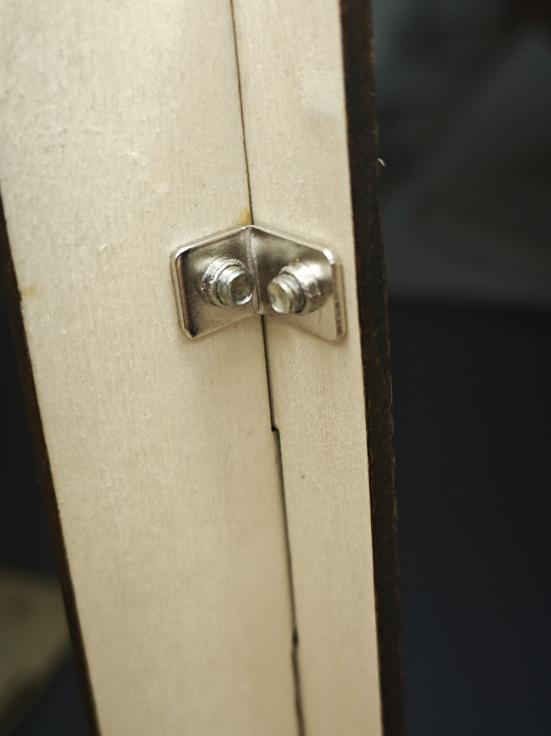
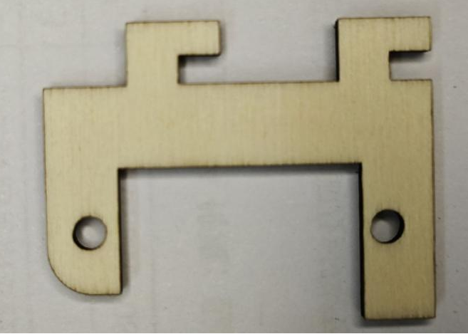
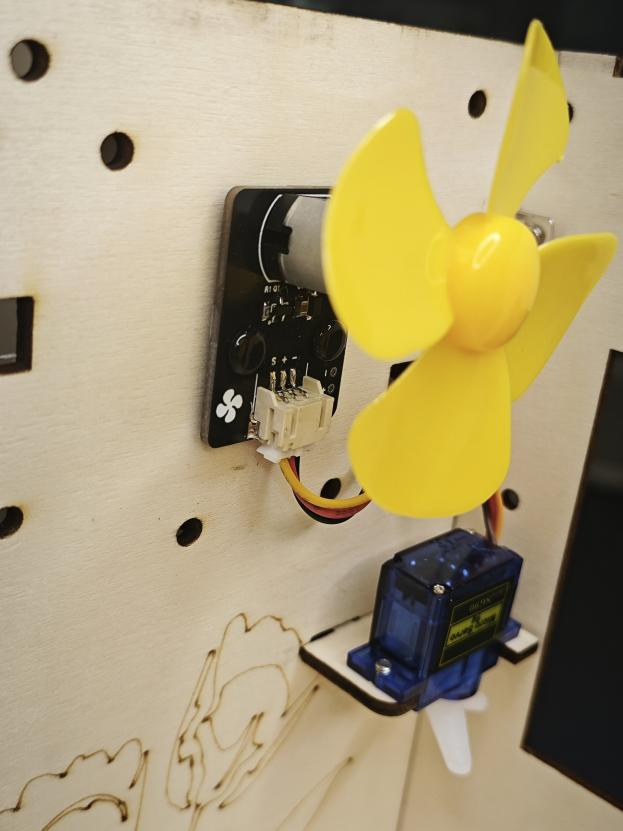

# 智慧农场组装教程

## 一、安装整体框架

1.1首先取出A号木板

1.2取4颗M3*16的螺丝，4颗M3螺母，4个脚垫，用螺丝刀将脚垫固定在A号木板的正面上。

1.3取出C号木板

1.4将C号木板对准A号木板背面的卡槽，竖直的安装进去

1.5取出D 号木板

1.6将D号木板对准A 号木板的卡槽，竖直的安装上去

1.7取出E 号木板

1.8将E号木板对准A 号木板的卡槽，竖直的安装上去

1.9取1颗M3的六面螺母，3颗M3*6的螺丝，用螺丝刀对A号木板、C号和E号木板进行加固。

 

1.10取1颗M3的六面螺母，3颗M3*6的螺丝，用螺丝刀对A号木板、D号和E号木板进行加固。

 

1.11取出B号木板

1.12取2颗尼龙柱，2颗M3*6的螺丝，将尼龙柱固定在B号木板的背面

1.13然后将C号木板和D号木板对准B号木板的卡槽，将B号木板安装上去

1.14取2颗M3的六面螺母，6颗M3*6的螺丝，用螺丝刀对A号木板、B号和C号木板之间进行加固；以及A号、B号和D号木板进行加固。

 

1.15再取1颗L型连接件，2颗M3*6的螺丝，用螺丝刀对A号木板和B号木板的中间进行加固

加固完成后如下图所示

1.16取4颗L型连接件，8颗M3*6的螺丝，用螺丝刀分别对B、C号木板，B、D号木板，C、E号木板和D、E号木板的上侧进行加固

 
 

## 二、安装门

2.1取出木板门

2.2取1个合页，4颗M3*6螺丝，4颗M3螺母，将门连接在D号木板上

2.3取出门的拉杆和拉杆固定件

2.4先将拉杆固定件上在门的卡槽上

2.5取出1个舵机固定件

2.6取出2颗M3*6的螺丝，1个180度的9g舵机，用螺丝将舵机安装在舵机舵机固定件上

2.7取出门的拉杆和舵机中配的单臂舵盘，再取1颗舵机里自带的自攻螺丝，将门的拉杆的一端连接在舵盘最小的孔上，注意拉杆的方向

2.8将舵盘安装在舵机上，安装舵盘之前舵机需要复位（先将舵机接在主板的数字接口D4，将程序下载到主板上，舵机就会进行自动复位），安装时门需要处于关闭状态。

2.9将舵机固定件安装在B号木板上，对准卡槽安装并向右推进

2.10取1颗M2*10螺丝，1颗M2螺母，将拉杆固定在拉杆固定件上

## 三、安装传感器设备

3.1取出CO2传感器，接上4P杜邦线，取2颗尼龙铆钉，将CO2传感器固定在B号木板上

缺图*2

3.2取出SHT30温湿度传感器，接上4P杜邦线，取2颗尼龙铆钉，将SHT30温湿度传感器固定在B号木板上

3.3取出电机风扇模块，接上3P杜邦线，取2颗尼龙铆钉，将电机风扇模块固定在B号木板上

3.4取出土壤湿度传感器，接上3P杜邦线，将土壤湿度传感器放在A号板上

3.5取出一个MOS管模块，接上3P杜邦线，取2颗尼龙铆钉，将MOS管模块固定在B号木板的背面上

 

3.6取出Arduino UNO主板，取4颗尼龙铆钉，将Arduino UNO主板固定在B号木板的背面

3.7取出传感器扩展板，将传感器扩展板堆积插在Arduino UNO主板上

3.8取出蓝牙模块，接上4P杜邦线，取2颗尼龙铆钉，将蓝牙模块固定在B号木板的背面上

 

3.9取出智慧农场的顶板

3.10取出光照强度传感器，接上4P杜邦线，取2颗尼龙铆钉，将光照强度传感器固定在智慧农场的顶板上。

 

3.11取出另一个MOS管模块，接上3P杜邦线，取2颗尼龙铆钉，将MOS管模块固定在智慧农场的顶板上。

3.12取出OLED液晶显示屏，接上4P杜邦线，取4颗M2*10的螺丝，4颗M2螺母，将OLED液晶显示屏从智慧农场的顶板的背面固定，将显示屏朝上。

 
3.13取出高亮LED模块，接上3P杜邦线，取2颗尼龙铆钉，将高亮LED模块固定在智慧农场的顶板的背面，将传感器朝农场里面。

 

## 四、安装智慧农场顶板

4.1将顶板安装在智慧农场框架的顶上，与B、C、D、E木板衔接卡紧，这里记得先将所有传感器的先从B号木板预留的线槽中引出。

4.2取2颗L型连接件，4颗M3*6的螺丝，用螺丝刀分别对顶板、B号木板；顶板、D号木板进行加固。

## 五、安装水泵和加热器

5.1取出水管、水泵和杯子，将水管的一头接在水泵的出水口，再将水泵放在杯子中，将水管的另一头穿过B号木板的圆孔，然后用扎带将水管整理绑扎在木板上。

5.2再取一根扎带，将水杯固定在B号木板的背面

5.3，将水泵的线接在MOS管的蓝色端子上（红线——V+ 、黑线——V-），需要用螺丝刀将座子拧松后再接线，然后再将端子拧紧。

5.4取出加热模块和加热模块固定件

 

5.5取2颗M3*10螺丝，2颗M3螺母，将加热模块夹在两块加热模块固定件之间，用螺丝固定紧。

5.6将加热模块固定件安装在智慧农场的顶板上，对准卡槽安装并向右推进

5.7将加热模块的线穿过顶板的圆孔，将线连接到顶板上的MOS管模块上的蓝色端子上（V+,V-）,需要用螺丝刀将端子拧紧。

## 六、连线

+ 将高亮LED模块用3P杜邦线连接到传感器扩展板的数字接口D5（黄线S—D5，红线VCC—5V，黑线GND—GND）；

+ SHT30温湿度传感器4P杜邦线连接到传感器扩展板的IIC接口（蓝线D—SDA，绿线C—SCL,红线VCC—5V，黑线GND—GND）（连第2个IIC接口）；

+ 将光线传感器用4P杜邦线连接到传感器扩展板的IIC接口（蓝线D—SDA，绿线C—SCL,红线VCC—5V，黑线GND—GND）（连第1个IIC接口）；

+ 土壤湿度传感器用3P杜邦线连接到传感器扩展板的模拟接口A3（黄线S—A3，红线VCC—5V，黑线GND—GND）；

+ CO2传感器用4P杜邦线连接到传感器扩展板的串口（蓝线RX—D6，绿线TX-D7，红线VCC—5V，黑线GND—GND）；

+ 电机风扇模块用3P杜邦线连接到传感器扩展板的数字接口D3（黄线S—D3，红线VCC—5V，黑线GND—GND）；

+ 将加热模块连接在MOS管（红线接V+，黑线接V-）上，MOS管模块用3P杜邦线连接到传感器扩展板的数字接口D10（黄线S—D10，红线VCC—5V，黑线GND—GND）；

+ 将水泵连接在MOS管（红线接V+，黑线接V-）上，MOS管模块用3P杜邦线连接到传感器扩展板的数字接口D11（黄线S—D11，红线VCC—5V，黑线GND—GND）；

+ 将9g舵机连接到传感器扩展板的数字接口D4（黄线S—D4，红线VCC—5V，黑线GND—GND）；

+ OLED显示屏用4P杜邦线连接到IIC接口（蓝线D—A4，绿线C—A5,红线VCC—5V，黑线GND—GND）；

+ 蓝牙模块用4P杜邦线连接到传感器扩展板的串口（蓝线RX—D8，绿线TX—D9，红线VCC—5V，黑线GND—GND）

连线图

## 七、安装背板

7.1取出G号木板

7.2取2颗M3*6的螺丝，将G号木板固定在B号木板背面的尼龙柱上

7.3取出主板的盖板

7.4取4颗L型连接件，8颗M3*6的螺丝，将主板的顶板分别与B号木板和G号木板固定。

8.5安装完成后如下图所示

九、安装花盆
9.1取出花盆的木板包，一共包含如图所示的7块木板

9.2将F板对准花盆背板的卡槽，插入进去固定卡紧

9.3将另一端也同样和花盆的前板固定卡紧

9.4取出左侧面的木板，将它卡在花盆的前后木板上

9.5取出2颗L型连接件，4颗M3*6的螺丝，将左侧木板分别与前后木板固定

 

9.6取出右侧面的木板，同样将它对准花盆前后木板的卡槽，安装卡紧

9.7取出2颗L型连接件，4颗M3*6的螺丝，将右侧木板分别与前后木板固定

固定完成后如图所示

9.8取出用来固定花盆底板的两根木条，先将长的木条安装卡在花盆的底部，再将短的木条安装卡上去，花盆就组装完成啦。

 

9.9先将接水盘放入农场中，然后将刚刚组装的花盆放在接水盘上，然后就可以在花盆中装上泥土，播撒一些种子，将土壤湿度传感器插入泥土中。

最终组装效果图

