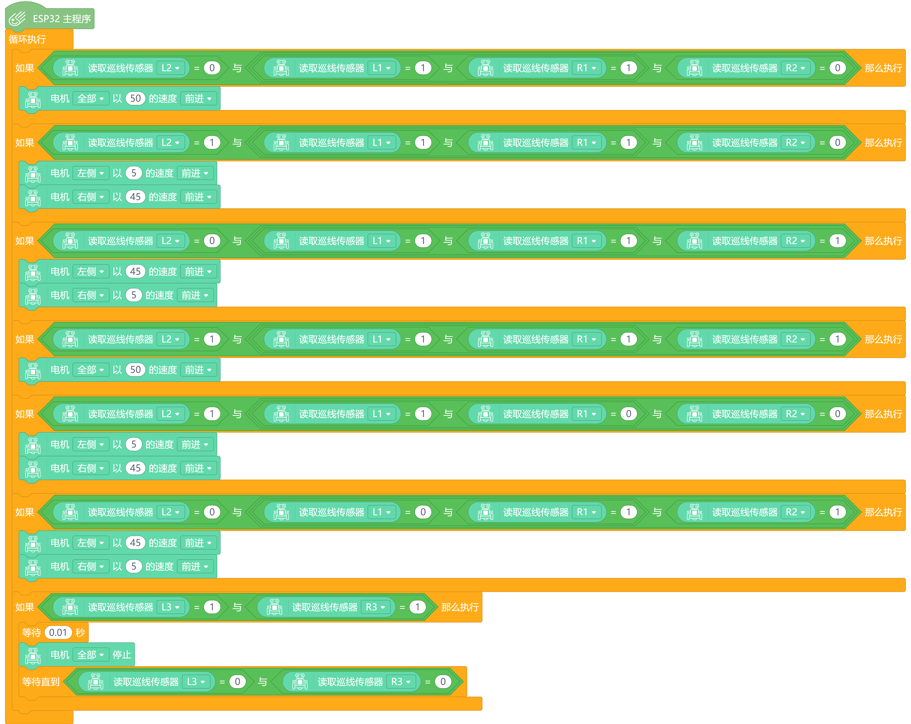

# 掌控板挑战赛小车

## 产品简介：

------

掌控竞技小车是一款专为创新教育与竞技比赛设计的智能小车。它无缝支持micro:bit和掌控板平台，为用户提供了多样化的学习和拓展机会。这款智能小车不仅外观小巧灵活，而且设计精美，是一款入门学习编程、传感器应用和机器人控制的理想工具，迷你的车身，有趣的功能，和即插即用的免接线方式能够快速学习图形化编程，方便使用图形化进行编程，

|  |  |
| ------------------------------------------------------------ | ------------------------------------------------------------ |

## 产品接口说明：

------

## 产品参数：

------

- 供电电压：3.5V~5V DC（1节18650电池-3.7V）
- 红外巡线传感器*6
- 红外接收×1
- RGB氛围灯×2
- I2C接口 (3.3V)×2    (3.7V)×1
- 舵机专用接口 ×3（S1 S2 S3）
- IO扩展口 ×9 （P0 P1 P2 P8 P9 P10 P13 P14 P15）
- N20金属减速电机×2
- 电机：2路N20电机
- 电机最大转速：600转/分
- 电机驱动方式：PWM电机驱动
- 编程方式：Mind+图形化编程
- 产品尺寸：宽81mm×长85mm

## 特殊说明：

- 使用microbit/掌控板进行控制时，需要将左侧的开关进行拨动到相应的模式 
- 使用microbit控制时，插入方向为microbit的LED在前面，使用掌控板控制时，插入方向为掌控板的屏幕在前面 
  

   

- 巡线校准说明：

1. 断电，取下主板。

2. 中间4个巡线传感器置于地图黑线，边上两个置于白线。

3. 上电开关从ON拨到OFF。

4. 开关由OFF拨动到ON。

5. 断电，插主板启动。

- 使用USB给18650电池充电时，充电指示灯会常亮，充满后充电充满指示灯会常亮，右侧有一排电池电量显示指示灯，电池电量满时，4个LED全亮，电量下降时，从下往上依次熄灭，代表电池的容量状态

- 电池方向：对应电池盒、板子上+ -标识

## microbit/掌控板使用教程：

### RGB控制：

------

目标：掌握RGB基本方法。

程序效果展示：全部RGB循环绿灯亮2S，红灯亮2S										

|  |  |
| :----------------------------------------------------------- | :----------------------------------------------------------- |

### 红外遥控：

------

目标：掌握红外遥控的基本方法

程序效果展示：按下遥控器，串口会输出接收到的数据，并且RGB灯会蓝色亮1S，变成绿色，绿色常亮，再次按下后循环

|  |  |
| :----------------------------------------------------------- | :----------------------------------------------------------- |

### 读取电机参数：

------

目标：掌握如何读取电机参数（包括电机圈数，速度，方向）

程序效果展示：电机以120的速度前进，字符串输出：L: 速度-电机方向-电机圈数       R:速度-电机方向-电机圈数

|  |  |
| ------------------------------------------------------------ | ------------------------------------------------------------ |

### 电机控制及PID：

------

目标：掌握如何通过PID控制电机

程序效果展示：电机以150的速度前进，然后以180的速度后退

|  |  |
| ------------------------------------------------------------ | ------------------------------------------------------------ |

### 舵机控制：

------

目标：掌握如何控制舵机的转动

程序效果展示：S1 S2 S3 舵机转动45度，等待一秒转动90度，循环转动

|  |  |
| ------------------------------------------------------------ | ------------------------------------------------------------ |

### 读取巡线传感器数字与灰度值：

------

目标：掌握如何读取巡线传感器数字与灰度值

程序效果展示：第一行为从左至右数字值，第二行为每个传感器的灰度值

|  |  |
| ------------------------------------------------------------ | ------------------------------------------------------------ |

### 超声波传感器读取：

------

目标：掌握如何读取超声波传感器的数值

程序效果展示：读取超声波传感器的值并通过串口打印

|  |  |
| ------------------------------------------------------------ | ------------------------------------------------------------ |

## microbit/掌控板进阶使用教程：

### 小车巡线：

------

目标：掌握如何通过读取四路巡线传感器数字进行控制电机巡线

程序效果展示：将电机放置在黑线上，直行，当要出线，最右边传感器状态改变，进行右转，最左边传感器状态改变，进行左转，完成巡线

microbit:

掌控板:

### 超声波避障：

------

目标：学习使用超声波躲避障碍物。

程序效果展示：当麦昆与障碍物的距离<=35cm时，左转，当距离<=10cm时，后退在右转。

|  |  |
| ------------------------------------------------------------ | ------------------------------------------------------------ |

### 红外遥控小车：

------

目标：使用红外线遥控器指挥小车前进或后退。

程序效果展示：红外线遥控器的2、4、6、8共4个按键遥控小车前进、左转、右转、后退。

|  |  |
| ------------------------------------------------------------ | ------------------------------------------------------------ |

| **按键**  | **码值** |
| :-------- | :------- |
| 红色按钮  | 255      |
| VOL+      | 127      |
| FUNC/STOP | 191      |
| 左箭头    | 223      |
| 暂停      | 95       |
| 右箭头    | 159      |
| 下箭头    | 239      |
| VOL-      | 111      |
| 上箭头    | 175      |
| 0         | 207      |
| EQ        | 79       |
| ST/REPT   | 143      |
| 1         | 247      |
| 2         | 119      |
| 3         | 183      |
| 4         | 215      |
| 5         | 87       |
| 6         | 151      |
| 7         | 231      |
| 8         | 103      |
| 9         | 167      |

### 小车正方形循迹：

------

目标：小车进行正方形赛道循迹

程序效果展示：小车在正方形赛道上正常循迹转弯

microbit：

掌控板：

​                                                                                                                                         

​    
