# Arduino入门教程

## Arduino编译环境下载  

下载最新版本的ArduinoIDE  
下载地址：https://www.arduino.cc/en/Main/Software  
## 电亮第一颗LED  

循环电亮13号引脚连接的LED灯，亮暗各一秒。  
示例使用板卡为Arduino UNO,测试例程前，提前获取ArduinoIDE（编程开发环境），并且已经正确安装好了USB驱动。  

### 连接arduino主板和电脑  

将USB线一端插在Arduino控制板上，一端插在电脑的USB接口上。（独立工作时Arduino控制板可以选择从USB供电, 也可以选择由电源适配器供电）

### 打开arduinoIDE  

打开Arudino IDE，就会出现Arduino IDE的编辑界面  

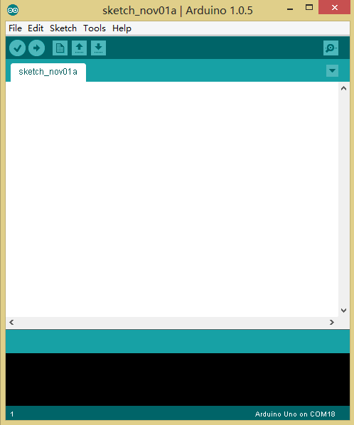  

### 设置语言

选择File>Preferences，在弹出的Preferences窗口中如下位置，设置IDE语言，如简体中文（Chinese Simplified）。关闭IDE并重启，界面会变成中文显示。   

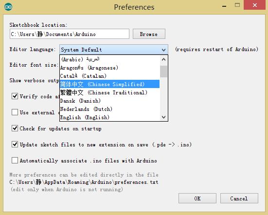  

### arduinoIDE界面  

打开arduinoIDE界面后

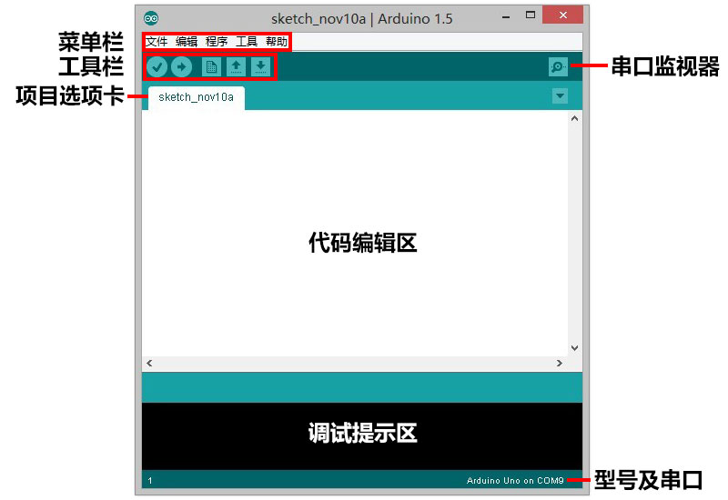  

* 校验（Verify）：
验证程序是否编写无误，如无误则编译该项目。 

* 下载（Upload）：  
下载程序到Arduino控制器上。  

* 新建（New）：  
新建一个项目。 

* 打开（Open）：  
打开一个项目。  

* 保存（Save）：  
保存当前项目。  

* 串口监视器（Serial Monitor）：  
IDE自带的一个简单的串口监视器程序，用它可以查看串口发送接收到的数据。  
相较于IAR、Keil等专业的硬件开发环境，Arduino的开发环境给人简单明了的感觉，但正是这种简单，省去了很多不常用的功能，让没有太多基础的使用者更容易上手。  
如果你是一个专业的开发人员，或者正准备使用Arduino开发一个大型项目，笔者推荐你使用Visual Studio、Eclipse等更为专业的开发环境进行开发。当然第三方的开发环境都需要你下载相应的Arduino插件并配置。  

### 安装Arduino驱动程序  

如果你使用的是Arduino UNO、Arduino MEGA r3、Arduino Leonardo或者这些型号对应的兼容控制器，并且计算机系统为Mac OS或者Linux，那你只需要使用USB连接线，插上Arduino控制器，系统会自动安装驱动，很快即可使用。其他型号的控制器或者Windows系统则需要安装驱动程序。  

Windows中驱动安装方法如下：  

1．使用USB线缆连接上Arduino后，计算机右下角会弹出气泡提示  

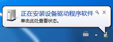   

2．通过右键点击 计算机>属性>设备管理器，你会看到如图1-27所示的设备： 

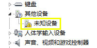  

3．双击该设备，并选择更新驱动程序，如图。  

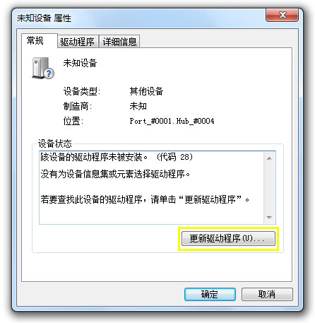  

4．如图，在弹出窗口中选择浏览计算机以查找驱动程序软件。  

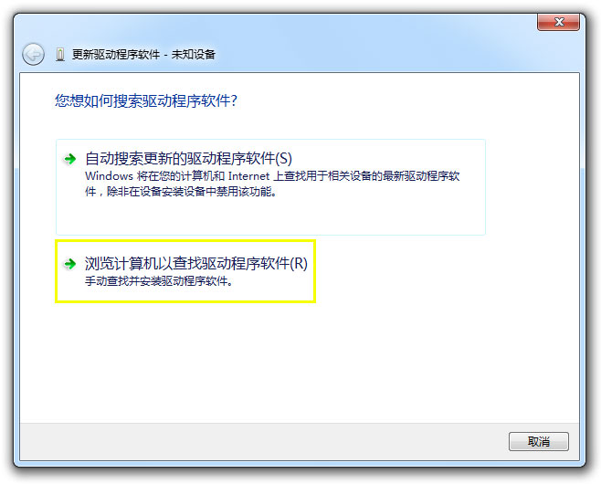  

5．如图，选择你的驱动所在地址（即Arduino安装目录下的drivers文件夹），并点击下一步，开始安装驱动。 

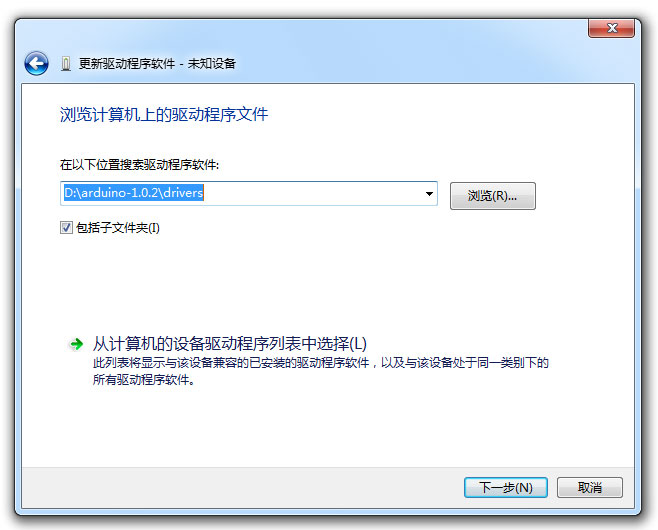  

6．如果你的Arduino IDE版本较老，安装过程中会弹出如图的 Windows安全提示，此时选择始终安装此驱动程序软件。  

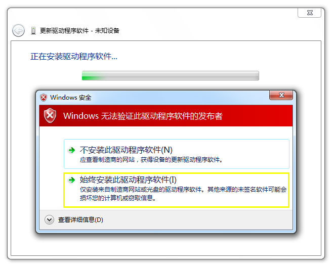  

7．安装完成后，会有提示信息。  

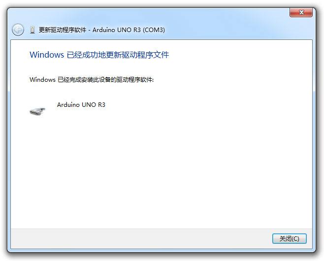   

8．此时在设备管理器中，你可以看到你的Arduino控制器对应的COM口了。记下该串口号，很快我们将使用上它。 

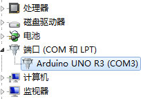   

### Blink——Arduino的Hello world！  

Hello World是所有编程语言的第一课，不过在Arduino中，我们的Hello World叫做Blink。  
Arduino提供了很多示例代码，使用这些示例代码，我们可以很轻松的开始我们的Arduino学习之旅。  
可以在文件菜单>示例>01.Basics>Blink找到我们要使用的例程，单击便可打开。 

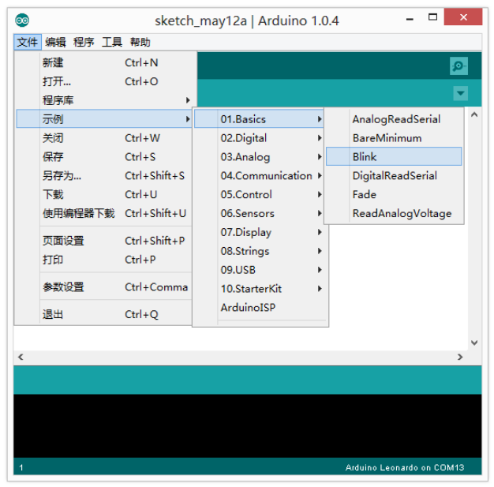  

打开后你可以看到以下代码：

```C++
/*
  Blink
  Turns on an LED on for one second, then off for one second, repeatedly.
  This example code is in the public domain.
*/

// 在大多数Arduino控制板上 13号引脚都连接了一个标有“L”的LED灯
// 我们给13号引脚设置一个别名“led”
int led = 13;

// 在板子启动或者复位重启后， setup部分的程序只会运行一次
void setup()
{                
  // 将“led”引脚设置为输出状态
  pinMode(led, OUTPUT);     
}

//setup部分程序运行完后，loop部分的程序会不断重复运行
void loop() 
{
  digitalWrite(led, HIGH);   // 点亮LED
  delay(1000);           // 等待一秒钟
  digitalWrite(led, LOW);   //通过将引脚电平拉低，关闭LED
  delay(1000);           //等待一秒钟
}
```

在编译或下载该程序前，我们需要先在工具菜单>板卡中选择你正在使用的Arduino控制器型号  

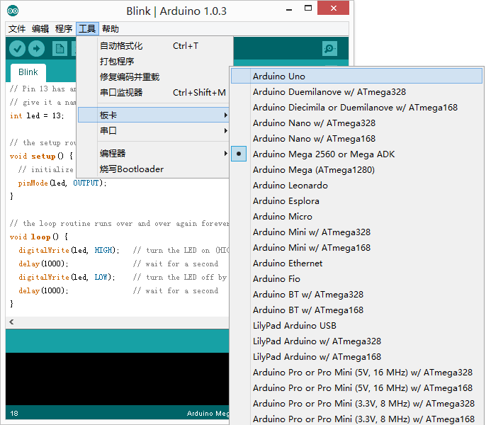  

接着在工具 菜单>串口 中选择你Arduino控制器对应的串口。在Windows系统中，串口名称为“COM”加数字编号，如COM3。选择串口时，你需要查看设备管理器中你的Arduino对应的串口号。

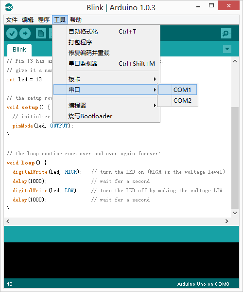  

在Mac OS或者linux中，串口名称一般为 /dev/tty.usbmodem加数字编号或/dev/cu.usbmodem加数字编号  

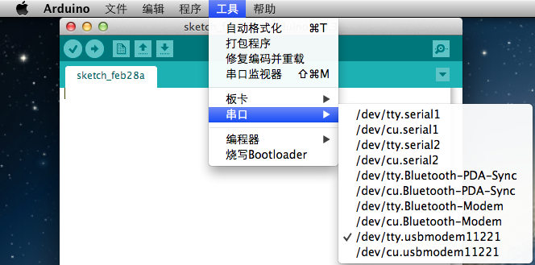    

板卡和串口设置完成后，你可以在IDE的右下角看到当前设置的Arduino控制器型号，及对应串口。  
接着点击校验（Verify）按键，IDE会自动检测程序是否正确，如果程序没有错误，调试提示区会依次显示“编译程序中”、“编译完毕”。编译完成后，你将看到如图提示信息。  

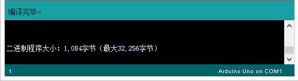 

点击下载（Upload）按键，调试提示区会显示“编译程序中”，很快该提示会变成“下载中”，此时Arduino控制器上标有TX、RX的两个LED会快速闪烁，这说明你的程序正在被写入Arduino控制器中。 

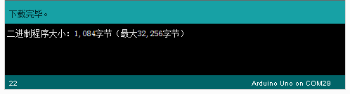   

此时，你就可以看到该段程序的效果了——板子上的标有L的LED在按你设定的程序闪烁了。  