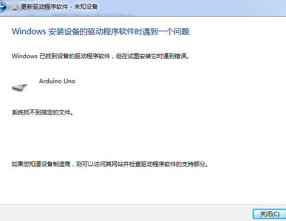
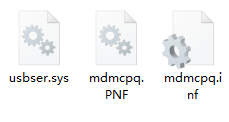
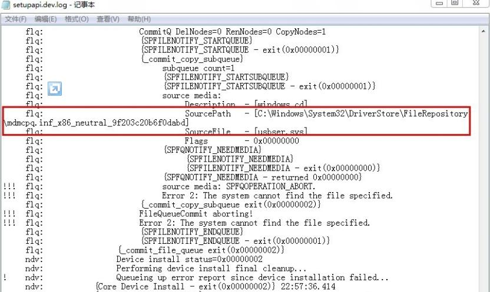
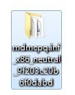
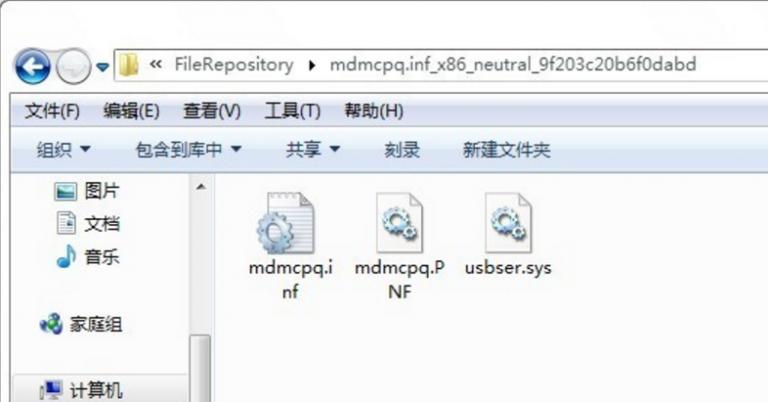

# arduino驱动安装失败处理办法

如果你使用的是精简版windows系统，安装Arduino驱动时，可能会遇到”系统找不到指定文件”这个问题，如下图：

90%的情况都是你电脑的问题，精简版操作系统和使用了一些优化软件通常是引起此类问题的原因。因为精简版的window系统删掉了一些不常用的驱动信息引起的，解决方法如下：

## 方法1
1、首先根据自己的系统下载缺少的系统文件<https://clz.me/mdmcpq/>

2、将mdmcpq.inf 复制到c:\windows\inf
将usbser.sys复制到c:\windows\system32\drivers

然后按照正常步骤重新安装驱动，重启电脑，测试看能否正常安装驱动。

## 方法2（如果以上办法还未能解决问题，尝试以下方法）

1.首先打开C:\windows\inf\setupapi.dev.log
这个文件包含了有关即插即用设备和驱动程序安装的信息，当然它也记录你Arduino驱动安装失败的原因。
打开该文件，滚动到文件末尾附近，你可以看到如下信息：

正是这个文件缺失，致使你的Arduino驱动无法安装。

2.在 C:\Windows\System32\DriverStore\FileRepository\ 路径下，新建一个mdmcpq.inf_x86_neutral_********文件夹

3.然后将方法一中下载的三个文件放在这个文件夹里

4.按照正常步骤重新安装驱动，或者重启电脑，测试看能否正常安装驱动
