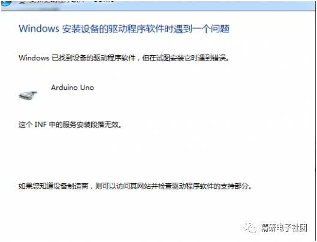
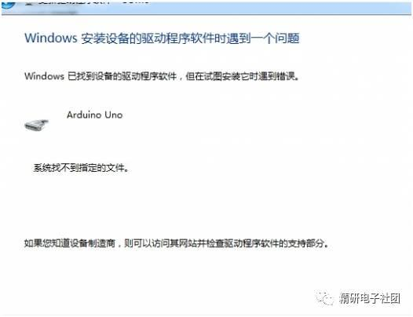
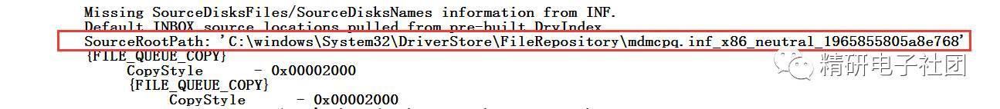
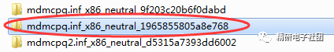
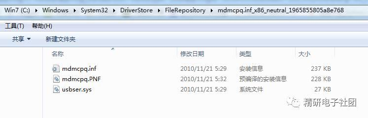
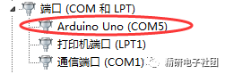
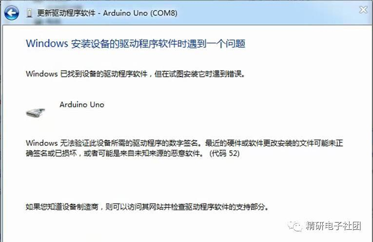

# arduino主板驱动安装失败

驱动安装失败，电脑系统的问题是罪魁祸首。正版系统是不会有任何问题的，简版操作系统、Ghost做的系统和优化软件通常是引起此类问题的原因。驱动安装失败问题就是操作系统缺少文件，现象如下：

如出现如上图的现象或在设备管理器中的驱动标识前有黄色的感叹号，那么说明WINDOW系统文件中有mdmcpq.inf或者usbser.sys文件丢失。解决方法如下：

下载mdmcpq.inf和usbser.sys两个文件，

 将mdmcpq.inf复制到c:windowsinf

 将usbser.sys复制到c:windowssystem32drivers

小技巧：比如要打开c:windowsinf，只要在地址栏（IE输入网址的地址栏和我的电脑里的地址栏都一样），输入c:windowsinf即可打开。 

这样通常到这里驱动问题就可以解决了，如果驱动问题还没有解决或又出现了下图中的问题：

这又是操作系统少了一些更不常用的驱动文件，解决方法如下：

1.首先打开C:windowsinfsetupapi.dev.log

 这个文件包含了有关即插即用设备和驱动程序安装的信息，当然它也记录你Arduino驱动安装失败的原因。

 打开该文件，滚动到文件末尾附近，你可以看到如下信息：

正是这个文件缺失，致使你的Arduino驱动无法安装。

2.在C:WindowsSystem32DriverStoreFileRepository 路径下，新建一个mdmcpq.inf_x86_neutral_********文件夹

每台电脑后面的标示不一样，*******具体是什么请参照上面setupapi.dev.log文件给出的提示信息。

例如，我这台电脑给出的信息为

C:WindowsSystem32DriverStoreFileRepositorymdmcpq.inf_x86_neutral_1965855805a8e768

根据该提示，我在C:WindowsSystem32DriverStoreFileRepository路径下，建立了一个同名文件夹，如下

3.在该文件夹中找到以下文件，解压后放入刚才新建的mdmcpq.inf_x86_neutral_********文件夹中。

4.再重新按步骤安装驱动，现在驱动就可以正常安装上啦！

如果在设备管理器里面看到Arduino Uno (COM+数字)，那么恭喜你，终于搞定了！

如果你的系统为windows XP/2000，按以上方法还是无法安装，那你可以尝试在注册表：

“HKEY_LOCAL_MACHINESOFTWAREMicrosoftWindowsCurrentVersion”中添加一个RunOnce项。

如果你的系统为WIN7 64位，就要特别注意了，安装驱动后如果有如下内容：

这个问题是因为64位系统强制要求所有设备驱动程序要有数字签名，因此只能通过启动系统时，F8进入高级选项，选择禁用数字签名，进入系统后驱动显示就正常了，可以成功使用了！

如果还没有成功，就是old的事情了，看这个<http://www.51hei.com/arduino/3816.html>