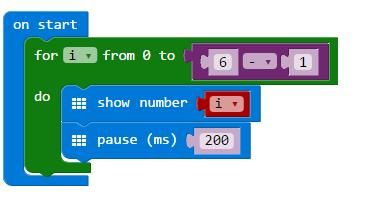
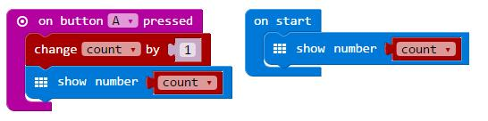
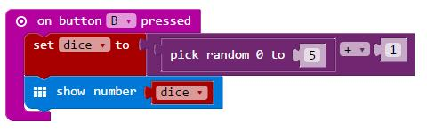
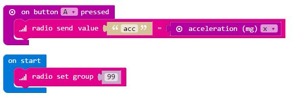
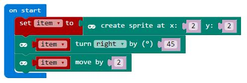
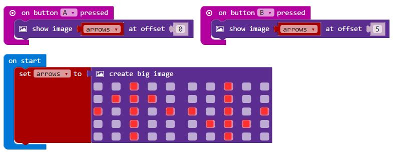
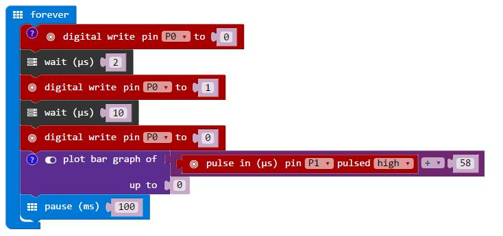

# 第一章 初识micro:bit

## 1.1 micro:bit简介

Micro:bit(全称BBC micro:bit)，是一款由英国广播公司(BBC)推出的，用于青少年编程教育的ARM开发板。

采用了基于ARM Cortex-M0的nRF51822处理器，集成蓝牙功能，板载5×5 LED点阵、两个可编程按键、加速度计、三轴地磁和温度计等资源。

还引出了20+5pin的扩展接口，可轻松胜任各种编程相关的教学与开发场景，包括编写电子游戏、机器人控制、科学实验和可穿戴装置开发等；仅有信用卡一半大小（4cm×5cm），你还可以把我集成到诸多便携的项目中。 


## 1.2软件

+ 支持微软开发的PXT图形化编程界面：

+ 支持Windows、macOS、iOS、安卓等多种操作系统

+ 编程环境基于Web服务，无需额外下载编译器

+ 电脑端通过USB烧写、仿真程序

+ 移动端通过蓝牙无线烧写、仿真程序

+ 还支持包括Javasript、Phython、Mbed C在内的多种主流的编程语言：

   + Microsoft TouchDevelop IDE
   
   + Microsoft Blocks
   
   + CodeKingdoms Javascript
   
   + MicroPython
   
   + mbed enabled


## 1.3特性

**5x5 LED 显示屏** —— 5x5 LED点阵，可以显示文字、图形等

**按键A/B** —— 可编程按键，可以检测这些按键何时被按下。

**I/O 引脚** —— 20+5个扩展引脚(含SPI、UART、I2C、Analog、PWM等功能)

**光线传感器**—— 将屏幕上的LED作为输入，LED屏幕作为基本的光传感器，可以检测周围的光线。


**温度传感器** —— 温度传感器允许微位检测当前环境温度，摄氏度。

**电子罗盘** —— Freescale MAG3110 3-axis 地磁传感器，I2C接口 。指南针探测到地球的磁场，允许你探测micro:bit的方向。罗盘在使用前必须先校准。

**加速度计** —— 采用 Freescale MMA8652 3-axis 加速度传感器，I2C接口。加速度计测量你的micro:bit的加速度；这个元件感知微位移。它还可以检测其他动作，例如抖动、倾斜和自由落体。

**无线电** —— 无线功能允许你在微比特之间进行无线通信。使用无线电发送消息到其他micro:bit，建立多人游戏，等等！

**蓝牙** —— 蓝牙（低功耗）允许micro:bit发送和接收蓝牙信号。这允许micro:bit与PC、手机或平板电脑进行无线通信，这样你就可以用你的micro:bit控制你的手机，也可以从你的手机无线发送代码到你的micro:bit上！

**USB 接口** —— Micro USB接口，用于接入电脑烧写、仿真程序，串口通信等，同时使用电脑给micro:bit 供电

**供电接口** —— 3V电源供电接口，通过外部电源（3V）供电

**复位按键** —— 按下后micro:bit重启程序

## 1.4硬件


Nordic nRF51822

16 MHz 32-bit ARM Cortex-M0 microcontroller

Bluetooth® 4.0 low energy/2.4GHz RF SoC

16kB RAM

256kB Flash

Freescale KL26Z – 48 MHz ARM Cortex-M0+内核的单片机

# 第二章 快速使用micro:bit

## 2.1 连接

通过microUSB数据线（普通安卓数据线）将micro:bit连接至计算机设备上。这些设备包含 Mac电脑、一般的PC、Chromebooks和linux系统的设备（包括Raspberry Pi）。

计算机中会出现一个名字叫'MICROBIT'的一个驱动盘符，注意识别，这不是一个普通的U盘。


## 2.2 编程

选择一个喜欢的代码编辑器（一种是 JavaScript 模块编辑器，一种是Python编辑器）来编写你的第一个micro:bit代码。例如我们使用JavaScript 在线编辑器，地址是：https://makecode.microbit.org  拖动显示模块实现如下图所示的功能代码，然后点击“Download”便可以使用编辑器左侧的仿真器进行仿真。


## 2.3 下载

点击“Download”后，同时会弹出一个窗口（如图所示）提示将HEX文件进行保存，这个hex文件就是程序进行编译后导出的micro:bit可识别的十六进制文件。然后就像拷贝文件到U盘一样的操作，将改文件复制到计算机中的micro:bit盘符中，
如果电脑系统是Windows，可以直接右键点击文件“ 发送到→MICROBIT ”。


系统如果是MAC，直接将文件拖放到micro:bit盘符中。


## 2.4 展示

将hex文件拖动到micro:bit盘符的时候，micro:bit的黄色指示灯不断闪烁，着提示正在下载，当下载完成后闪烁停止，代码将自动运行。

在每次下载程序后，micro:bit驱动会自动弹出，但是你的hex文件将被清除。同时等待接收下一次的hex文件。（micro:bit盘符中只允许接收hex文件，不会存储其他东西）


本页向您展示了如何开始从使用JavaScript块给micro:bit编程，，您也可以使用Python和基于文本的JavaScript来给你的micro:bit编程。

# 第三章 参考程序模块

## 3.1 基础模块

+ showNumber
  
+ showlcon

+ showleds

+ showString

+ clearScreen

+ forever

+ pause

+ showArrow

**showNumber**

在LED屏幕上显示一个数字，如果要显示1个以上的数字，那么它会向左滑动把数字显示完成。
```
function showNumber(value: number, interval?: number): void;

Value 是一个整型的数字

Interval （区间）是一个可选的数字。
它意味着每次滑动一个LED所留下的值之前的毫秒数。
间隔越大，滑动越慢。
```

示例1：显示数字10


示例2：显示一个存在变量里的数字


示例3：循环显示数字0到5



**Showlcon**

在LED屏上显示选定的图标
```
function showIcon(icon: IconNames, interval = 600);

参数：
Icon 要显示的图标的标识符
Interval(可选) 显示图标保持的时间，默认是400
```
示例：显示一个高兴的脸，1秒后，显示一个悲伤的脸


**Showleds**

在LED显示屏上显示图片

```
function showLeds(leds: string, interval?: number): void;

参数：

Leds 是一个字符串，用于控制哪些LED亮或者灭
Interval 是一个可选数字，表示在现实一张图片后腰等待多少毫秒，如果使用模块编程，建个时间默认设置为400毫秒。
```

示例：使用该功能在LED屏幕中显示图片


**ShowString**

显示一个字符串在LED屏幕上，如果显示的字符超过屏幕大小，那么会向左移动显示。
```
function showString(text: string, interval?: number): void;

参数：
Text 是一个字符串，它可以是字母、数字和标点符号
Interval 是一个可选数字，它表示每次显示一个字符后向左滑动的毫秒数，间隔越大，滑动越慢。
```
示例1：显示一个单词“hello”


示例2：显示一个存在变量里的字符串


**ClearScreen**

将LED屏幕上的所有LED都关掉

*function clearScreen(): void;*

示例：显示一个心后将所有led关掉


**Forever**

在后台重复运行的一部分程序

    function forever(a: () => void): void;

示例1：不断检查电子罗盘的方向并更新屏幕显示


示例2：使用Micro:bit制作计数器，当按下按键A时，数字增加。


示例3：争夺LED显示，当程序的不同部分同一时间都在要求LED屏幕显示自己想要显示的东西，那么你可能会得到一个意料之外的结果。


**Pause**

指定程序在某个时刻暂停多少毫秒，你可以用这个函数模块来减慢程序运行速度。
```
function pause(ms: number): void;

参数：
Ms 是要暂停的毫秒数，1000毫秒=1秒
```

示例：通过点亮LED屏中左上角到右下角的led来显示对角线，每显示一次灯亮后暂停500毫秒，如果没有暂停，那么灯会亮得非常快，以至于你没有足够时间观察到灯已经打开过。


**Show Arrow**

在LED屏幕上显示选定的箭头

```
function showArrow(direction: number, interval = 600);

参数：
Direction 是箭头指向的方向
Interval (可选)显示箭头的时间，默认是400ms
```
示例：显示8个方向的箭头


## 3.2 输入模块

+ On button pressed

+ On gesture

+ On pin pressed

+ Button is pressed

+ Compass heading

+ Pin is pressed

+ Temperature

+ Acceleration

+ Light level

+ Rotation

+ Magnetic force

+ Running time

+ Set accelerometer range

**On button A pressed**

按键A 或 B：这种处理程序工作在当按键按下并在1秒内松开的情况下。

按键A 和 B：这个处理程序工作时，A和B都按下，然后其中一个松开，另外一按键在1.5秒内被按下。

```
function onButtonPressed(button: Button, body:() => void): void;
```
示例1：计算你按下按钮的次数。每次按下按钮，LED屏幕显示计数变大。



示例2：掷色子—当按下显示1到6之间的一个数字



**On Gesture**

启动一个事件处理程序（当事件被触发时运行的里面的程序），这个处理器在执行一个手势时工作（比如抖动micro:bit）。
```
function onGesture(gesture: Gesture, body: () => void): void;

参数：
Gesture 是指你拿去或者移动micro:bit的方法，
例如：摇动（shake）,logo up, logo down, screen up, screen down, tilt left, tilt right, free fall, 3g, or 6g.
```
示例：随机数—当你摇动micro:bit时，LED显示0~9的一个随机数


**On pin pressed**

启动一个事件处理器（当事件触发时（如按键按下），部分程序运行起来。）这种事件处理器工作在当你将0，1或者2号脚连接在GND上，然后1秒内断开的时候。当你在web浏览器中仿真此函数时，单击屏幕上的引脚，而不是micro:bit上的引脚。

如果你用一只手握住GND引脚，另一只手接触0，1或者2号引脚，一个非常小的电流会流过你的身体并回到micro:bit中，这成为“回路”，就像你是一根导电大铁丝！

```
function onPinPressed(name: TouchPin, body: () => void): void;

（这个功能最好工作在电池给micro:bit供电的时候，而不是USB供电的时候）

参数：
Name 是指被连接在GND（被按下）的引脚，如  P0,P1或者P2
```

示例:

计算P0被按下的次数，每次按下这个针脚，显示器中计数增加。


**Button is pressed**

判断按键是否被按下，micro:bit有两个按键，A和B。

```
function buttonIsPressed(button: Button): boolean;

参数：
Button 是个字符串，输入A时检查左边的按键，输入B是检查右边的按键，输入A+B是检查两边的按键是否同时被按下。
该函数模块返回的是一个布尔类型（boolean），当检查到被按下时返回 ture，如果没有被按下，返回false.
```
示例：

使用if语句来判断是否按键A被按下，如果按下显示数字1，否则显示数字0


**Compass heading**

找出micro:bit朝向哪个方向，micro:bit通过磁力计芯片测量指南针朝向0到360度之间的一个角度。

```
function compassHeading(): number;

程序模块返回一个0到360度之间的一个数字，表示朝向的角度，如果指南针没有准备好，将返回-1003。
```
示例1：


查找罗盘朝向，并将角度值存在 degrees 这个变量中


如果在仿真器模拟这个函数的话，在屏幕中点击并拖动指南针，改变指南针的方向。

示例2：

找到指南针的朝向，显示一个字母，来表示micro:bit朝向的是北（N），南（s），东（E），还是西（W）。


每次你开始使用指南针时（举例，如果你刚吧micro:bit打开时），micro:bit会开始校准指南针（自我调整），它会请求你通过倾斜micro:bit来划一个圆圈。

尽量避免在金属附近使用指南针，这将导致你的测量不准确。

通过按下A+B后来校准更为方便


**Pin is pressed**

查找引脚是否被连接在GND。如果你用一只手握住GND引脚，另一只手接触0，1或者2号引脚，一个非常小的电流会流过你的身体并回到micro:bit中，这成为“回路”，就像你是一根导电大铁丝！
```
function pinIsPressed(name: TouchPin): boolean;

（这个功能最好工作在电池给micro:bit供电的时候，而不是USB供电的时候）

参数：
Name 是指被连接在GND（被按下）的引脚，如  P0,P1或者P2
该函数模块返回的是一个布尔类型（boolean），当检查到被按下时返回 ture，如果没有被按下，返回false.
```

示例：

检查P0是否被连接到GND，如果是LED屏幕显示1，否则显示0.


**Temperature**

测量你当前所在的环境温度（摄氏温度）

```
function temperature(): number;

返回一个数值表示 对应的摄氏温度

该温度是检查micro:bit的CPU的实际温度，因为micro:bit的温度通常不会太烫，CPU的温度通常接近环境中的温度。
```

示例1：

通过LED屏显示温度数值


示例2：

将测出来的摄氏温度转化为华氏温度，并显示在LED屏中


试着对比你的micro:bit温度与实际的环境温度，你也许能找到两者的温差，然后通过调整程序获得一个更准确的温度值。

**Acceleration**

获取XYZ三个维度的加速度值，

查询micro:bit的加速度值即它加速或者减速的速度

```
function acceleration(dimension: Dimension): number;

G是地球的重力加速度，函数将测量到的是加速度的单位是milli-g, 1milli-g = 1/1000G

参数：
Dimension 是指你检测到的某个方向上的加速度或者这个方向加速度的合成值。
x：左右方向的加速度。
y：向前和向后方向的加速度。
z：上下方向的加速度。
力量：所有维度（方向）中所有力量的总和。

返回：
一个表示加速度大小的数值，当micro:bit平放在桌面时（屏幕向上），获得的X为0，Y为0，Z为-1023，然后合成值为1023
```
示例1：用图表的形式显示micro:bit的加速度值


示例2：地震仪—每个5秒显示一次加速度的值，来判断是否发生震动


**Light level**

测量你所在地方的光亮等级（明亮或者黑暗），0级表示黑暗，255表示明亮。Micro:bit通过使用LED屏幕上的一些LED来测量周围的光线。

第一次使用它时，这个函数会返回0，之后会测出真正的光线水平，这事因为光线传感器（能够感知光线的部分）需要先打开。
```
function lightLevel(): number;

返回：
一个0（暗）~255（亮）的光线数值。
```

示例1：显示光线值—当按下按键B时，将光线值显示在LED屏幕中


示例2：光线表—使用表格的方式显示光线值


**Rotation**

查询micro:bit在不同方向上倾斜的次数
```
function rotation(kind: Rotation): number;

<Micro:bit的加速度计（accelerometer）能够检查出micro:bit是怎样移动的>

参数：

Kind 表示你要检查的哪个方向，Rotation.Pitch（上和下）或者Rotation.Roll(左和右)

返回：

Micro:bit在某个方向上倾斜的数值（从0~360度）的一个值
```

示例：micro:bit水平仪—这个程序帮助你移动micro:bit直到它是水平的，当它是水平的，用LED显示一个笑脸。


**Magnetic Force**

查寻在你制定方向上的磁场强度。

```
function magneticForce(dimension: Dimension): number;

参数：
Dimension表示micro:bit应该测量哪个方向上的磁场强度，
Dimension.X (左右方向)
Dimension.Y (前后方向）
Dimension.Z (上下方向）

返回：
一个表示毫特斯拉（microteslas）磁场强度的一个数字。如果返回数字是1000，那么磁场强度为1000毫特斯拉，也就是1特斯拉（1T）
```

示例：金属探测器—当检测到磁场强度越强，将micro:bit的LED屏幕中的中心LED变得更亮，反之，将LED亮度减弱。


**Running Time**

查询从程序运行到现在所花费多少毫秒的时间

```
function runningTime(): number;

返回：一个从程序开始运行到现在的毫秒数字，（1000毫秒就等于1秒）
```
示例：

当按下按键B时，LED屏中显示程序运行到此花费了多少毫秒（ms）


**Running Time Micros**

查询从程序运行了多少毫秒
```
function runningTimeMicros(): number;

返回：
一个从程序开始运行到现在的微秒数字，（1000000微秒就等于1秒）
```
**Set Accelerometer Range**

设定一个加速度测量值的范围
```
function setAccelerometerRange(range: AcceleratorRange): void;

参数：
Range 表示你将测量到的加速度的最大值（1g,2g，4g或者8g），不管当你在获取重力值时还是在获取加速度值的时候，如果micro:bit测到的更大的值时将被忽略。
```

示例：程序设定你的micro:bit将最大测量4G的加速度值，然后将其显示在LED屏幕中。


这个程序不能被仿真，只能讲其下载到micro:bit中才能工作。

## 3.3 音乐模块

+ PlayTone

+ ringTone

+ Rest

+ beginMelody

+ onEvent

+ Beat

+ Tempo

+ changeTempoBy

+ setTempo

**PlayTone**

通过micro:bit的P0端口播放你制定的音乐

```
function playTone(frequency: number, ms: number): void;

参数：
Frequency 是音调的赫兹数（音乐的高或低）
Ms 是指音调持续的多少毫秒的时间
```
示例：将音符C存在变量freq中，接着，播放这个音符1秒钟


使用函数“analogSetPitchPin” 可以修改播放音乐的其他引脚


**ringTone**

通过P0播放一个音调，你可以指定他高音或者低音，直到你通知它停止播放。

这个功能只工作在micro:bit或者一些浏览器仿真中。
```
function ringTone(frequency: number): void;

参数：
Frequency是指这个音调高音或者低音的一个赫兹（Hz）数
```
示例：

通过检测micro:bit的加速度计上的加速度值，来播放音乐。


使用函数“analogSetPitchPin” 可以修改播放音乐的其他引脚


**Rest**

让P0口停止播放声音

这个功能只工作在micro:bit或者一些浏览器仿真中。
```
function rest(ms: number): void;

参数：
Ms 是指声音持续的多少毫秒的时间
```
示例：


**beginMelody**

通过P0引脚，开始模仿音乐旋律

这个功能只工作在micro:bit或者一些浏览器仿真中。

```
function beginMelody(melodyArray: string[], options: MelodyOptions = 1);

参数：
Melody 是表示要播放音乐旋律的一个数组
```
示例：播放自带的音乐 Entertainer


**onEvent**

建立一个音乐事件

```
function onEvent(value: MusicEvent, handler: Action);

参数：

Value是指时间类型

Handler指当时间被触发时将运行这段代码
```
示例：将所有时间打印到串口输出上


**Beat**

返回这个拍子打了多少毫秒

这个功能只工作在micro:bit或者一些浏览器仿真中。
```
function beat(fraction?: BeatFraction): number;

参数：
BeatFraction：

返回：
一个表示多少拍的毫秒数
```
示例：


**Tempo**

查询节奏（一段音乐的播放速度）

```
function tempo(): number;

返回：

一个表示一分钟的节奏数
```

**changeTempoBy**

改变拍子的速度，让节奏更快或者更慢。

这个功能只工作在micro:bit或者一些浏览器仿真中。
```
function changeTempoBy(bpm: number): void;

参数：
bpm（beats per minute每分钟的节奏数），这个参数是指bmp改变的数值。
```

示例1：改变播放音乐的节奏快12bpm


示例2：改变播放音乐的节奏快12bpm


**setTempo**

按照你要求那样制定音乐播放速度

这个功能只工作在micro:bit或者一些浏览器仿真中。
```
function setTempo(bpm: number): void;

参数：
bpm（beats per minute每分钟的节奏数），这个参数是指bmp改变的数值。
```
## 3.4 LED屏幕

+ plot

+ unplot

+ point

+ toggle

+ brightness

+ plotBrightness

+ setBrightness

+ stopAnimation

+ plotBarGraph

+ led.fadeIn

+ led.fadeOut

+ led.plotAll

+ led.screenshot

+ led.toggleAll

+ led.setDisplayMode

+ enable
  
**plot**
```
让LED屏幕点亮你指定的LED

function plot(x: number, y: number): void;

参数：
x 是指横向的数字，从左到右分别是0，1，2，3，4
y是指纵向上的数字，从上到下分别是0，1，2，3，4
如果这个参数值超出了0到4的范围，那么这个功能将不起作用
```
示例1：点亮右下角的LED


示例2：使用循环点亮一个LED方阵


**unplot**

关掉LED屏幕上你指定的LED
```
function unplot(x: number, y: number): void;

参数：
x 是指横向的数字，从左到右分别是0，1，2，3，4
y是指纵向上的数字，从上到下分别是0，1，2，3，4
如果这个参数值超出了0到4的范围，那么这个功能将不起作用
```
示例：点亮一系列LED然后将中间位置的LED关掉


**point**

查询你指定的LED是亮还是灭
```
function point(x: number, y: number): boolean;

参数：
x 是指横向的数字，从左到右分别是0，1，2，3，4
y是指纵向上的数字，从上到下分别是0，1，2，3，4
如果这个参数值超出了0到4的范围，那么这个功能将返回 false

返回：
布尔值，如果led是点亮的，那么返回 true，如果是熄灭的，返回false
```
示例：如果中间的灯是亮的那么将它关掉


**toggle**

切换指定LED的状态
```
function toggle(x: number, y: number): void;

参数：
x 是指横向的数字，从左到右分别是0，1，2，3，4
y是指纵向上的数字，从上到下分别是0，1，2，3，4
如果这个参数值超出了0到4的范围，那么这个功能将不起作用
```
示例:切换中间LED的开关状态


**brightness**

查询亮着的LED的亮度
```
function brightness(): number;

返回：
一个0~255的一个数字，0表示最暗，255表示最亮，127表示正常亮的状态。
```

示例1：设定LED屏显示到最大亮度


示例2：先将整个LED屏设置到最亮，然后将中间的一个LED的亮度调整到50%。


**plotBrightness**

指定某个LED的亮度值
```
function plotBrightness(x: number, y: number, brightness: number): void;

参数：
x 是指横向的数字，从左到右分别是0，1，2，3，4
y是指纵向上的数字，从上到下分别是0，1，2，3，4
Brightness 是一个0~255的亮度数值
如果这个参数值超出了0到4的范围，那么这个功能将不起作用
```
示例1：以中等亮度点亮一个LED


示例2：使用一个循环，点亮一个不同亮度的方阵


**setBrightness**

设定整个LED的亮度
```
function setBrightness(value: number): void;

参数：
Value表示LED的亮度值，从0（最暗）~255（最亮）
这个功能只工作在micro:bit中，不支持网页仿真。
```
示例：点亮LED到最亮，等待1秒后，将亮度缩减一半


**stopAnimation**

停止显示任何动画和其他正待等待播放的画面

    function stopAnimation(): void;

示例：当正在显示字符串的时候，按下按键B，将停止所有显示


**plotBarGraph**

把数字转换成一种条形图表进行显示
```
function plotBarGraph(value: number, high: number): void;

参数：
Value 是你要显示的数值，例如，你要用micro:bit来显示测量的冰的温度，那边这个value应该是0，因为冰的温度是零下温度
High是指参数能达到的最大数值，同样可以用来表示条形图中最高的数
```
示例：测量X方向（左右方向）上的加速度值，将其用条形图显示出来，在X方向移动越快，条线最高线就越高，直到达到你指定的最高值（这里是1023）


**led.fadeIn**

淡入屏幕

**led.fadeOut**

淡出屏幕

**led.plotAll**

点亮所有LED

**led.screenshot**

将LED屏幕截图，然后返回一张图片

**led.toggleAll**

转换当前LED显示的状态

**led.setDisplayMode**

设置LED的显示模式是黑/白/灰度

**enable**

将LED屏打开或者关闭
```
function enable(on: boolean): void;

参数：
On 是一个布尔类型数值，用来定义屏幕开或者关的状态
```
示例：按下按键B关掉屏幕


P3,P4,P6,P7,P9,P10
这些引脚是连接在led矩阵上的，同样与光线传感器有联系。在默认状态下是关闭了光线检测这个功能的。如果关闭LED显示功能的话，调用DAL 功能 led.enable(false)。如果需要再次将显示功能打开，那么调用函数led.enable(true)。

## 3.5 无线电

+ SendNumber

+ sendValue

+ sendString

+ onDataPacketReceived

+ setGroup

+ setTransmitPower

+ setTransmitSerialNumber

+ writeReceivedPacketToSerial

**SendNumber**

向通过无线连接的micro:bit上广播数字
```
function sendNumber(value: number): void;
参数：
Value -发送一个数字
```
示例1：向其他micro:bit广播你当前micro:bit上加速度计检测到的X方向上的加速度值。这种程序可以用于模型小车或者模型火箭上。


示例2：光照发射器-广播发出当前检测到的光线值。


**sendValue**

无线发送字符串或数字到其他micro:bit中，字符串最大长度是12字节

```
function sendValue(name: string, value: number): void;

参数：
Name 是通过无线发送的一个字符串
Value 是通过无线发送一个数字
```

示例1：向其他micro:bit广播X方向上的加速度值



示例2：LED屏显示无线接收到的字符串或者数字


**sendString**

通过无线发送字符串到连接在同一区域中的micro:bit中，最大字符串长度为19字符。
```
function sendString(msg: string): void;

参数：
Msg 是通过无线发送的一个字符串
```

示例：如果将该程序下载到两个或者多个micro:bit中，当按下按键A，发送一个字符串出去。然后其他的micro:bit将接收到字符串并显示在LED屏上。


一个无线点可以同时做发射器和接收器被称为收发器

**onDataPacketReceived**
当你的micro:bit接收到无线电，就运行下面程序

    function onDataPacketReceived(cb: (packet: Packet) => void);

回调参数：

Packet-无线接收的数据包，这种数据包有如下特性

ReceiverNumber-这个数据包中发送的数字，如果数据包里没有数字，那么将返回0

receivedString-这个数据包中发送的字符串，如果数据包里没有字符串，那么将返回0

Time-micro:bit发送这个数据包的系统时间

Serial-micro:bit发送数据包中的串口号，如果micro:bit没有包含它的串口号，那么将返回0

Signal-无线信号的强度（-128到-42从弱到强）

示例1：不断发生加速度数值，并同时接收附近其他micro:bit发来的数字。然后通过条形图显示在LED上。


示例2：通过检测数据包的信号强度，来显示两个micro:bit之间的距离。


**setGroup**

一个组相当于一个线路通道（同一时间，micro:bit 只能发送或者接收数据，不能同时发送同时接收数据），group ID相当于线路通道的编号。

如果你不告诉程序要使用哪个group ID，它将自己算出它自己的group ID。如果将相同的程序上传到两个不同的micro:bit上，它们将能够相互交谈，因为它们将具有相同的group ID。
```
function setGroup(id: number): void;

参数：
Id 是一个从0到255的一个数字
```
示例：创建一个ID为128的组群


**setTransmitPower**

设置micro:bit无线信号的强弱，0表示最弱，7表示最强
无线信号强度的单位是dBm（decibel-milliwatts），信号强度0的时候信号值约-30dBm，信号强度为7时信号值约+4dBm

```
function setTransmitPower(power: number): void;

范围：
如果你的micro:bit发送的数据强度是7，并且你周围没有其他计算机设备，那么micro:bit的信号能发送至约70米的位置。

参数：
Power 是一个0到7的一个数字，表示信号的强弱

```
示例：
设置最大等级的无线信号


**setTransmitSerialNumber**

使板子串口号嵌入到无线数据包中传输。
```
function setTransmitSerialNumber(transmit: boolean): void;

参数：
Transmit 是一个布尔数据，表示串口号是否需要被传输
```
示例：在发送的每个无线数据包中嵌入串口号


**writeReceivedPacketToSerial**

将无线接收的最后一个数据包以Json格式写入串行。这应该在回调函数中调用到接收的数据包。
```
function writeReceivedPacketToSerial(): void;

数据接格式

接收到数据并输出到串口上的数据格式如下：
 Send number : {v:ValueSent,t:MicrobitTimeAlive,s:SerialNumber}
Send value : {v:ValueSent,t:MicrobitTimeAlive,s:SerialNumber,n:"Name"}
Send string : {t:MicrobitTimeAlive,s:SerialNumber,n:"Text"}
```
示例：另外一张micro:bit按下按键A后，发出测量到的温度数据，当接收到无线数据后，将接收到的温度数据通过串口显示出来


## 3.6 游戏

+ Sprites  
createSprite  
delete  
move  
turn  
ifOnEdgeBounce  
get  
set  
change  
isTouching  
isTouchingEdge  
 
+ Scoring  
addScore  
score  
setScore  

+ Game control  
startCountdown  
gameOver  
pause  
resume  

### 3.6.1 Sprites

**createSprite :** 创建一个LED角色指向右边，这个角色像一个led生物，然后你可以告诉它移动、旋转或者检查是否撞到了另一个角色。
```
function createSprite(x: number, y: number): LedSprite;

参数：
X: 角色在左右方向移动
Y:角色在上下方向上移动
0到4表示屏幕的边框，2表示屏幕的中间
```
示例：
在屏幕中央创建一个角色，然后角色朝右下角移动，最终，把两个LED移动到角落里。


**Delete**

删除游戏中的角色
```
public delete(): void;

参数：
你想在游戏中删除的角色
```
示例：制作一个角色，并在屏幕上显示它的亮度，然后，把它删除。


**Move**

移动你指定数量的LED
```
public move(leds: number): void;

参数： 表示这个角色移动多少颗led
```
**Turn**

指定角色移动的方向
```
public turn(direction: Direction, degrees: number);

参数：
Direction-选择角色应该朝左还是右转向
Degrees-角色转变的角度数。
```
示例：在屏幕中央启动一个角色，然后角色从右下角，移动2个led到拐角处。


**If On Edge, Bounce**

让创建的角色遇到LED屏幕边时候弹开
```
public ifOnEdgeBounce(): void;

参数：
Direction-选择角色应该朝左还是右转向
Degrees-角色转变的角度数。
```
示例：在屏幕右边设置一个角色，当按下按键，检测到边框有角色时，将角色从反方向弹开，并显示出弹开的角度数。


**Get Sprite Property**

获取角色属性
```
public get(property: LedSpriteProperty);

参数：
Property-你想了解这个角色的属性 如：
X、Y表示角色在X或者Y方向上有多远
Direction 角色指向的方向（和turn功能类似）
Brightness 角色有多亮（和brightness功能类似）
Blink 角色闪烁的速度，（数值越大，闪烁越快）

返回：你请求得到的数字
```

示例：在左侧中间生成一个角色，然后显示屏幕中的这个角色的亮度值。


**Set Sprite Property**

设置角色的属性

    public set(property: LedSpriteProperty, value: number);

**change Sprite Property**

修改角色的属性

    public change(property: LedSpriteProperty, value: number);

```
参数：
Property-你想设置的这个角色的属性 如：
X、Y表示角色在X或者Y方向上有多远
Direction 角色指向的方向（和turn功能类似）
Brightness 角色有多亮（和brightness功能类似）
Blink 角色闪烁的速度，（数值越大，闪烁越快）
```
示例：在屏幕左侧创建一个角色，等待2秒后，将其移动到屏幕的右边。


```
参数：
Property-你想修改这个角色的属性 如：

X、Y表示角色在X或者Y方向上有多远
Direction 角色指向的方向（和turn功能类似）
Brightness 角色有多亮（和brightness功能类似）
Blink 角色闪烁的速度，（数值越大，闪烁越快）

Value-要修改某个特性的数量
```
示例：在屏幕左侧创建一个角色，等待2秒后，将其X坐标修改到2（也就是中间）。


**Touching**

检查一个角色是否碰到了你指定的另外一个角色
```
public isTouching(other: LedSprite): boolean;

参数：
Ledsprite 是你要检查的角色
Other 是另一个要被触碰并的角色

返回：
如果两者碰到，返回true
```
示例：创建两个角色，分别叫matter和antimatter，然后检查两者是否碰到，如果是LED屏显示“boom”


**Touching Edge**

查询这个角色是否接触到LED屏幕的边缘
```
public isTouchingEdge(): boolean;

返回：
如果碰到屏幕边缘，返回 true
```

示例：在LED屏幕左边的中间位置建立一个角色，然后判断，它是否碰到屏幕边缘，如果是，LED显示“EDGY”，否则显示“SAFE”


### 3.6.2 Scoring

**addScore**

为当前游戏添加更多分数
```
function addScore(points: number): void;

参数：
Points-是指添加的分数值，负数意味着从分数中减去对应的数值。
```
示例：编写一个简单的游戏，尽可能多的按下按键A来增加粉丝，按下B时，显示分数，并将分数清零。


**Score**

查询游戏的分数

    function score(): number;

示例：按下按键A，游戏分数增加1分，并显示1个动画，然后等待500毫秒，显示你的分数


**Set Score**

设置当前分数值
```
function setScore(value: number): void;

参数：
Value-表示要新设置的分数值
```
示例：按下按键A时分数加1，按下按键B时，显示当前分数，并将分数清零


## 3.6.3 Game control

**Start Countdown**

从指定的时间（单位是ms）开始倒计时
```
function startCountdown(ms: number): void;

参数：
Ms 是指从多少ms的时候开始倒计时
```
示例：在10秒内尽可能多的按下按键A来获得得分。


**Game over**

结束游戏，并显示分数

    function gameOver(): void;

示例：程序开始请求你按下一个按键，如果你按下按键A时，显示“YOU WIN”，如果按下的是按键B，显示一个动画并终止游戏。


**Pause**

暂停游戏渲染引擎，允许屏幕上显示其他动画。

    function pause(): void;

**Resume**

在暂停后恢复游戏渲染引擎。

    function resume(): void;

## 3.7图片

+ createImage

+ createBigImage

+ showImage

+ scrollImage

+ arrowImage

+ iconImage

+ arrowNumber

**CreateImage**

为micro:bit的LED屏制作一张显示图片
```
function createImage(leds: string): Image;

参数：
Leds 是一个指定哪些LED亮，哪些LED灭的一个字符串，
```
示例：当按下按键A时，显示一个向上的箭头，按下按键B时显示向下的一个箭头


**createBigImage**

创建一张大图片，这是将两个LED矩阵组合在一起。
```
function createBigImage(leds: string): Image;

参数：
Leds 是一个指定哪些LED亮，哪些LED灭的一个字符串。
```
示例：创建一张大图片，分别排列着一个向上和向下的箭头图片，如果按下按键A，屏幕中显示大图片左边的一半的图片，按下按键B，显示图片右边的一半。


**showImage**

屏幕显示一张图片，然后暂停400毫秒
```
showImage(xOffset: number, interval?: number): void;

参数：
Interval-通常是一张由5行LED组成的正方形的图片，
Xoffset- led从多少帧开始显示。0表示显示第一帧，5表示显示第二帧，10表示显示第三帧，依此类推。
```
示例：按下按键A时显示第一帧，按下按键B时显示第二帧



**scrollImage**

滚动显示图片
```
scrollImage(frameOffset: number, interval: number): void;

参数：
frameOffset：一次刷新led的列数（从左到右），如果这里是一个正数，如2，图片将从屏幕的右侧滚动到左侧。如果这里是一个负数，如-2，那么图形会向一个反方向滚动。如果你使用5或者-5，图像将一次性刷新整幅图片。
Interval ：滚动播放图片之间间隔的时间数。
```

示例：一次性滚动刷新5列LED，然后暂停200毫秒。


**arrowImage**

在LED屏中创建一个箭头图像
```
function arrowImage(i: ArrowNames): Image;

参数：
i-指向的这个方向的名字（North\North\East\SouthEast\South\SouthWest\West\NorthWest）
```
示例：按下按键A显示左箭头，按下按键B显示右箭头


**iconImage**

在LED屏中建立一个图标图像
```
function iconImage(i: IconNames): Image;

这里有很多提前制作好的图片可以用来显示在LED屏幕上。你可以通过选择图标名称来显示该图片

参数：
i-你要显示在LED屏幕上图标的名称，例如：IconNames.Heart
```
示例：按下按键A显示一张笑脸，按下B按键时显示悲伤脸


**arrowNumber**

获取箭头图片名称对应的数字编号
```
function arrowNumber(arrow: ArrowNames): number;

每张箭头图片的名称对应一个数字编号和他匹配，你可以通过它的编号查找到对应图片。

参数：
Arrow:通过箭头名字获取到的箭头编号。
箭头方向名字有（North\North\East\SouthEast\South\SouthWest\West\NorthWest））
```
示例：获取ArrowNames.South这个方向的数字编号


## 3.8 引脚

+ Pins

   + DigitalReadPin

   + digitalWritePin

   + analogReadPin

   + analogWritePin

   + analogSetPeriod

   + map

   + onPulsed

   + pulseDuration

   + pulseIn

   + setPull

   + analogPitch

   + analogSetPitchPin

+ Servos

   + servoWritePin

   + servoSetPulse

+ I2C

   + i2cReadNumber

   + I2cWriteNumber

+ SPI

   + spiWrite

   + spiFrequency

   + spiFormat

   + spiPins

**Pins**

**DigitalReadPin**

读取对应引脚的数字高低电平（0或者1）

```
function digitalReadPin(name: DigitalPin): number;
有些引脚同时被连接到LED屏中

参数：
Name:是存引脚名称的一个字符串（P0，P1··最大到P20）

返回：
一个0或者1的数字
```

示例：当发现P0读到的数字电平是1时，将分数加1，然后使P2输出一个高电平（1），显示分数1秒后，将P2输出为低电平（0），如果连接在P2接口上的是蜂鸣器的话，那么蜂鸣器会播放出声音。


**digitalWritePin**

将引脚输出一个数字高（1）低（0）电平。
```
function digitalWritePin(name: DigitalPin, value: number): void;

参数：
Name-是存引脚名称的一个字符串（P0，P1··最大到P20）
Value- 一个0或者1的数字
```

示例：当按下按键B时，将P1引脚输出高电平，然后等待1秒后，将P0输出成低电平。如果连接在P1上的是一个蜂鸣器，在输出高电平时，蜂鸣器会叫。


**analogReadPin**

读取引脚上的模拟值（0到1023）
```
unction analogReadPin(name: AnalogPin): number;

参数：
Name-是存引脚名称的一个字符串（P0到P4，或者P10）

返回：
一个从0~1023的数字
```
示例：LED屏显示P1读到的模拟值


**analogWritePin**

在制定引脚上输出一个（0~1023）模拟值。
```
function analogWritePin(name: AnalogPin, value: number): void;

Name-是存引脚名称的一个字符串（P0到P4，或者P10）

Value- 一个0或者1023的数字
```
示例：在P0引脚输出1023模拟值


**analogSetPeriod**

在制定模拟引脚上配置脉冲宽度调制（PWM）的周期，在调用这个函数之前，应将制定的Pin设置为模拟。
```
function analogSetPeriod(name: AnalogPin, micros: number): void;

Name-是存引脚名称的一个字符串（P0到P4，或者P10）

Micro-周期的设定时间，单位为微秒（1000微秒=1毫秒，1000毫秒=1秒）
```
示例：将P0引脚模拟输出512，然后设置PWM的周期为20000微妙


**map**

将一个数字从一个区间，映射到另外一个区间范围
```
function map(value: number, fromLow: number, fromHigh: number, toLow: number, toHigh: number): number;

参数：
Value-将要被映射的一个数字
fromLow-初始区间最小值
fromHigh-初始区间最大值
toLow-目标区间最小值
toHigh-目标区间最大值
```
示例：将P0接口上读取到的一个数字，从0到1023的区间，映射到0到4取件。然后将其在对应LED第一排的对应的列数位置的LED点亮。


**onPulsed**

为特殊引脚配置数字输入，然后当引脚接收到指定脉冲（高或者低）时执行相关制定的代码。
```
function onPulsed(name: DigitalPin, pulse: PulseValue, body: () => void): void;

参数：
Name-是存引脚名称的一个字符串（P0，P1··最大到P20）
Pulse-指定哪种状态能够触发相关代码（High或者Low）
```
示例：设置P2引脚，如果有低电平，就触发下面相关的LED显示字符串“LOW”


**pulseDuration**

检查脉冲持续的时间是多少微秒

这个功能将调用一个On plused处理器
```
function pulseDuration(): number;

返回：
脉冲持续的时间，单位为微秒
```
示例：等待P0引脚变成高电平，然后在LED屏中显示这个高电平持续了多少微秒。


**pulseIn**

返回一个检测到某个引脚高或者低电平的时间周期。
```
function pulseIn(name: DigitalPin, value: PulseValue, maxDuration?: number): number;

参数：
Name-是存引脚名称的一个字符串（P0，P1··最大到P20）
Value-脉冲的高或者低
MaxDuration-如果没有接收到脉冲的最长时间。

返回：
脉冲持续的时间，单位为微秒
```
示例：使用超声波传感器读取距离超声波到障碍物之间的距离值



**setPull**

给特定引脚设置拉动输出

Micro:bit的许多引脚可以配置成拉动输出，例如：设置成上拉就可以将引脚初始的时候设置输出高电平（也就是3.3V）。如果在P0和GND之间连接一个按键，然后按下按键，P0将检测到0V，这样micro:bit就可以检查到按键按下的状态。
```
function setPull(name: DigitalPin, pull: PinPullMode): void;

内部上拉电阻值是13K

参数：
Name-是存引脚名称的一个字符串（P0，P1··最大到P20）
Pull-引脚设置成的状态（上拉up、下拉down、或者不作处理none）
```
示例：将P0设置为上拉输出


**analogPitch**

使P0引脚发送出PWM信号，使用analogSetPitchPin函数来设置改引脚。
```
function analogPitch(frequency: number, ms: number): void;

参数：
Frequency-播放的频率
Ms-播放的周期（持续的时间）
```
示例：从P0引脚更换到P1引脚进行播放音调。


**analogSetPitchPin**

指定的引脚（P0，P1，P2）用来产生音调。
```
function analogSetPitchPin(name: AnalogPin): void;
  
参数：
Name-是存引脚名称的一个字符串（P0，P1或者P2）
```
示例：设置P0引脚输出音调，指定播放频率和周期


**Servo**

+ servoWritePin

+ servoSetPulse

**servoWritePin**

让连接在该引脚上的舵机控制其转轴转动。如果连接的是标准舵机，那么输入的角度数就是舵机将要转动到的角度。如果是使用连续旋转的舵机，0度表示舵机向一个方向全速转动，180度表示舵机从反方向全速转动，如果是90度，那么舵机将不转动。

```
function servoWritePin(name: AnalogPin, value: number): void;

参数：
Name-是存引脚名称的一个字符串（P0到P4或者P10）
Value-是一个从0到180的数字
```
示例1：设置舵机输出到90度


示例2：让舵机指向获取到的加速度值


示例3：设置360度舵机朝一个方向全速连续转动


**servoSetPulse**

设置特殊引脚作为模拟输出，设置输出脉冲的周期是20ms，然后设置你指定的脉冲宽度值。

也可以通过设置脉冲宽度，来控制舵机转动。
```
function servoSetPulse(name: AnalogPin, micros: number): void;

参数：
Name-是存引脚名称的一个字符串（P0到P4或者P10）
Micros-模拟输出PWM周期的时间，单位是微妙。
```
示例：设置1000微秒的脉宽，来控制舵机转动。


## 3.9 I2C

+ i2CReadNumber

+ i2CWriteNumber

**i2CReadNumber**

使用一个特殊的数字格式，读取一个I2C地址传来的数据
```
function i2cReadNumber(address: number, format: NumberFormat, repeated?: boolean): number;

这个功能不支持仿真，只能在真实的硬件中才能实现。

参数：
Address-一个7位数据的I2C设备地址，你可以从这个地址中读取设备传来的数字
Format-你要读取的数字格式
Repeated-不断重复的读取。如果设置为true，设置一个重复启动条件来确认从设备中读到了数字。如果设置成false（默认状态），
不需要设置启动条件就可以不止一次的读到数字。

返回：
一个你请求读取某个格式的数据。
```
示例：从一个7位的I2C地址32中读取一个 大端、16位、无符号整形格式的数据


**i2CWriteNumber**

向一个I2C地址中写入一个特定格式的数据
```
function i2cWriteNumber(address: number, value: number, format: NumberFormat, repeated?: boolean): void;

这个功能不支持仿真，只能在真实的硬件中才能实现。

参数：
Address-一个7位数据的I2C设备地址，你可以从这个地址中读取设备传来的数字
Value-你要发送到的那个地址的数字
Format-你要发送的数字的格式
Repeated-不断重复的读取。如果设置为true，设置一个重复启动条件来确认从设备中读到了数字。如果设置成false（默认状态），
不需要设置启动条件就可以不止一次的读到数字。
```
示例：发送2055这个数值到 一个32位数字组成的7位I2C地址中，格式为，大端、整形。


## 3.10 SPI

+ spiWrite

+ spiFrequency

+ spiFormat

+ spiPins

**spiWrite**
```
function spiWrite(value: number): number;

参数：
Value-发送给SPI从机的数据

返回：
SPI从机返回的相应（1个数字）

```
**spiFrequency**

设置SPI时钟频率
```
function spiFrequency(frequency: number): void;

参数：
Frequency：SPI的时钟频率值。单位Hz(赫兹)
```
示例：从连接在SPI总线的设备上读取WHOAMI寄存器中的数据。I2C片选引脚为P0，通信引脚为P13、P14和P15


**spiFormat**

设置SPI格式

    function spiFormat(bits: number, mode: number): void;

**spiPins**

设置SPI通信引脚（MOSI、MISO、SCK）
```
function spiPins(mosi: DigitalPin, miso: DigitalPin, sck: DigitalPin): void;

MOSI- MOSI 引脚
MISO-MISO 引脚
SCK- SCK 引脚
```

## 3.11 串口通讯Serial

+ writeLine

+ writeNumber

+ writeValue

+ writeString

+ readUntil

+ readLine

+ readString

+ onDataReceived

**writeLine**
串口写入字符串，并以换行回车结束
```
function writeLine(text: string): void;

参数：
Text-要写入的字符串
```
示例1：串口重复输出字符串“B0FF0”


示例2：串口发送指南针检查到的方位


**writeNumber**

串口写入一个数字
```
function writeNumber(value: number): void;

参数：
Value-串口要输出的数字
```
示例1：串口输出1个10位数


**writeValue**

串口写入一个名字或数字，并以换行符（\r\n）结束
```
function writeValue(name: string, value: number): void;

参数：
Name-要串口发送的字符串
Value-要串口发送的数字
```
示例：串口每10秒发送温度和光线数据。


## writeString

串口输出字符串
```
function writeString(text: string): void;

参数：
Text-串口输出的字符串
```
示例：串口输出字符串“JUMBO”


**readUntil**

从串行端口读取文本，直到找到分隔符为止。
```
function readUntil(delimiter: string): string;

返回：
包含串口输入部分的字符串，如：用户输入的响应。
```
示例：当接收到，时，串口输出，之前的字符串


**readLine**
从串口中读取一行文本
```
function readLine(): string;

返回：
包含串口输入部分的字符串，如：用户输入的响应。
```
示例：串口读取文本，将其作为你的名字串口打印出来


**readString**


**onDataReceived**

当以下符号被匹配上就触发下面的事件。
```
function onDataReceived(delimiters: string, body: () => void): void;

参数：
Delimiters——是包含要匹配的字符的字符串。
```
示例：读取被，分隔开的数字


**Read Buffer**

在缓冲区中读取可用的串口数据
```
function readBuffer(length: number): Buffer;

参数：
Legth-串口要读取的字符的数量

返回：
一个包含从串口输入的一个缓冲器，缓冲器的长度可能会比请求获取的长度小些。
```
示例：
从串口中读取自付数据，一次读一行，然后将这一行数据，输出到连接在I2C引脚上的LED显示器。


**Write Buffer**

串口输出一个缓冲数据
```
function writeBuffer(buffer: Buffer): void;

将你的字符数据存在一个已经建好的缓冲区中，所有数据，缓冲器的长度都被输出到串口中。

参数：
Buffer-一个输出到串口中的缓冲器
```
示例：
从一个I2C设备中读取字符数据，然后将这个数据输出到串口号中


**Serial Redirect To**

使用引脚（除了USBTX和USBRX）动态配置串口实例
```
function redirect(tx: SerialPin, rx: SerialPin, rate: BaudRate): void;

参数：
Tx-串口发送引脚
Rx-串口接收引脚
Rate-串口收发数据的波特率（9600或者115200）
```
示例：当按下按键A，配置一个串口实例，新配置实用P1发送数据，P2接收数据，并设置波特率为9600


## 3.12 控制

+ InBackground

+ Reset

+ waitMicros

+ onEvent

+ raiseEvent

+ eventTimestamp

+ eventValue

**InBackground**

在运行其他程序时，运行另一部分程序

    function inBackground(a: () => void): void;

示例：让一部分程序在后台运行（屏幕显示存在变量num中的分数），同时，另一部分程序通过按下按键，增加存在变量num的分数


下面程序实现同样功能，但通常会使用一个forever循环实现。


**Reset**

复位重启micro:bit的程序

这个功能和按下micro:bit的复位按键实现一样的功能。

    function reset(): void;

示例：显示按下按键A而获取的分数，如果你不想玩了，按下按键B后，将程序复位。


**waitMicros**

等待多少微秒

    function waitMicros(micros: number): void;

示例：让P0发出10秒的高脉冲


**onEvent**

在事件总线中引发事件

**raiseEvent**

在事件总线中引发事件

**eventTimestamp**

获取在总线上执行的最后一个时间的时间戳

**eventValue**

获取在总线上执行的最后一个事件的值

## 3.13 蓝牙

像其他拥有和micro:bit一样拥有蓝牙服务的设备，如智能手机。如果要和micro:bit相互传输数据，首先需要进行配对。当两者配对完成，就可以将micro:bit上的功能参数与其他蓝牙设备进行数据交换。

**Pairing**

**怎样将micro:bit与其他蓝牙设备进行配对？**

Micro:bit要准备好配对先准备以下步骤

1、同时按下micro:bit的按键A和按键B，不要放开。

2、在按下按键A和B的同时，按下背后的复位按键

3、你将发现在显示屏上显示“PAIRING MODE!”，这时候就可以松开按键A和按键B

4、最终你会发现你的micro:bit会显示一个奇怪的模式，这就像你的micro:bit专属签名。其他人的micro:bit将显示不同的模式。

这时候你的micro:bit已经准备好和其他设备配对了。

**怎样将你的micro:bit与一个windows/安卓智能手机进行配对？**

1、进入设置

2、选择蓝牙

3、将你的micro:bit切换到已经准备好配对的状态

4、等待你的micro:bit显示完“PAIRING MODE！”你将在你的智能手机或者平板的蓝牙设置清单下发现micro:bit蓝牙设备。

5、点击设备清单中的“micro:bit”设备，这将启动配对进程

6、Micro:bit将显示向左的箭头，智能手机会弹出一个消息框，会提示你输入一个配对密码

7、按下按键A，仔细观察micro:bit显示屏中出现的一个6位数的数字密码，将它记下来。

8、在智能手机中的提示框中输入刚记住的6位数密码，然后点击“完成”。

9、如果你输入了正确的配对密码，micro:bit会显示一个 tick/check 标签。如果输出密码出错，它会显示一个十字或者X，提示你应该重新输入测试。

**怎样将你的micro:bit与一个苹果IOS智能手机进行配对？**

与苹果IOS设备配对的步骤和其他的设备有些不一样，你需要在APP Store下载一个叫“nRF MCP”的一个app，然后你可以按照以下步骤进行配对

1、将你的micro:bit切换到已经准备好配对的状态

2、等待你的micro:bit显示完“PAIRING MODE！”

3、登陆 nRF MCP应用，在蓝牙设备列表中会出现你的micro:bit，点击“连接”

4、点击“连接”后，启动了配对进程

5、Micro:bit 将显示一个左箭头，苹果手机会弹出一个消息框，提示你输入一个配对密码

6、按下按键A，仔细观察micro:bit显示屏中出现的一个6位数的数字密码，将它记下来。

7、在智能手机中的提示框中输入刚记住的6位数密码，然后点击“完成”。

8、如果你输入了正确的配对密码，micro:bit会显示一个 tick/check 标签。如果输出密码出错，它会显示一个十字或者X，提示你应该重新输入测试。

**什么时候需要配对？**

使用的时候不需要每次都配对。

有些情况会导致数据丢失，当这种情况发生时，你需要重新配对。

目前，通过USB下载新代码到micro:bit时，蓝牙配对数据会丢失，你需要再次配对。

如果你是通过蓝牙上传新代码到micro:bit上时，你就不需要重新再配对

如果你要与另外的设备配对，那么需要你将当前配对的设备删除：

>在安卓上进入设置/蓝牙，选择micro:bit旁边的“齿轮”，然后选择 忘记
>在IOS进入设置/蓝牙，选择你micro:bit，然后选择忘记这个设备
> 在windows设备进入设置/蓝牙，按住windows设备中的“micro:bit ”，弹出一个“删除”方框，点击“删除”。


**On bluetooth connected**
这个函数将开启一个事件处理器，当其他设备通过蓝牙连接到你的micro:bit上时，将运行事件下面的程序

    function onBluetoothConnected(body: () => void): void;

示例：当检查到已经与其他蓝牙设备有蓝牙连接时，显示“C”。程序可以扩展为，当你检测到有手机通过蓝牙连接到你的micro:bit上时，可以将micro:bit积累的数据，如统计的分数、加速度值等数据传输到手机上。


On bluetooth disconnected
这个函数将开启一个事件处理器，当其他设备已经通过蓝牙连接到你的micro:bit上后突然断开连接时，将运行事件下面的程序

function onBluetoothDisconnected(body: () => void): void

示例：使用事件处理器，当你的蓝牙设备与micro:bit断开连接时，在LED屏幕中显示“D”


**Start accelerometer service**

蓝牙加速度计服务允许像智能手机这样的设备通过蓝牙无线接收micro:bit的加速度数据。加速度计是用来检测运动，确切的说，它是测量XYZ三个方向的加速度值来判断向哪个方向在运动。

使用蓝牙加速度计服务可以用来在智能手机中创建一个app，如：当你的micro:bit被移动时，你手机中的角色会发出巨大的噪音。或者当你倾斜micro:bit来控制手机游戏中的卡通人物的移动。

在micro:bit上不需要额外的代码来使用来自另一设备的蓝牙加速度计服务。

    function startAccelerometerService(): void;

示例：启动一个蓝牙加速度计服务


**Start button service**

蓝牙按键服务允许将micro:bit的按键（A/B）状态值发送给通过蓝牙与micro:bit连接的其他像智能手机这样的设备。

每个按键有三种状态可以被识别到

1、未按下

2、按下

3、长按（按下至少2秒钟）

例如，你可以把智能手机藏在房间里某个地方，当你按下micro:bit的任意一个按键时，让你的手机发出一个有趣的声音
在micro:bit上不需要额外的代码来使用来自另一设备的蓝牙加按键服务。

    function startButtonService(): void;

示例：启动一个蓝牙按键服务


Start io pin service
蓝牙io引脚服务允许将连接在micro:bit引脚上的电子器件发出来的数据通过蓝牙与你的智能手机进行数据交换。
例如你可以使用智能手机来打开或者关闭连接在micro:bit引脚上的灯。又如你可以将连接在micro:bit引脚上传感器发过来的数据通过蓝牙传输给智能手机，让你的手机与传感器进行互动。
在micro:bit上不需要额外的代码来使用来自另一设备的蓝牙IO引脚服务。

function startIOPinService(): void;

示例：启动一个蓝牙IO引脚服务


**Start led service**

启动一个蓝牙led服务，可以将智能手机中的信息通过蓝牙传输给micro:bit并显示在LED显示屏中。所以，你可以在手机APP上画一个笑脸，让它显示在micro:bit的LED显示屏中。又例如，你可以将手机接收到的电子邮件、短信或者社交媒体的消息显示在micro:bit中。

在micro:bit上不需要额外的代码来使用来自另一设备的蓝牙LED引脚服务。

    function startLEDService(): void;

示例：开启一个蓝牙LED服务


**Start magnetometer service**

蓝牙磁力计服务允许像智能手机这样的设备通过蓝牙无线获取micro:bit测得的磁场数据，指南针可以检测出地磁场强度和磁场方向，所以，这可以被用来制作数字的电子指南针。

使用该服务，你可以创建一个可以实时显示旅行方向的手机APP。

在micro:bit上不需要额外的代码来使用来自另一设备的蓝牙磁力计服务。

    function startMagnetometerService(): void;

示例：开启一个蓝牙磁力计服务


**Start temperature service**

蓝牙温度服务是将micro:bit测量的大概的环境温度值（实际测量的是处理器的温度值），通过蓝牙无线传输给其他蓝牙设备，如智能手机。

使用micro:bit传来的温度数据（多少摄氏度），可以在智能手机中设计一个图形温度计。

在micro:bit上不需要额外的代码来使用来自另一设备的蓝牙温度服务。

    function startTemperatureService(): void;

示例：开启一个蓝牙温度服务


**Start uart service**

蓝牙串口服务允许像智能手机这样的设备与micro:bit数据交换。蓝牙串口服务模拟硬件串口通讯，允许一次最多交换20字节的数据。

当使用此服务时，micro:bit设置一个60字节的缓冲区，它将接收到的数据放在缓冲区，直到缓冲区塞满。当你的代码中使用到蓝牙串口服务时，你可以指定一个特殊字符，该字符可以用来表示另外一个设备要发送过来的最多3个整块消息，然后micro:bit将缓冲区的所有内容发送给要读取的它的代码中，换句话说，这个特殊字符被称为“分隔符”。

你可以使用串口服务做很多事情，你可以创建一个猜谜游戏，使micro:bit或者智能手机传递问题和答案。或者你可以将连接在micro:bit引脚上的摄像头的拍到的照片数据通过蓝牙发送给智能手机。

要从另一个设备使用蓝牙UART服务，您需要额外的micro:bit代码，这代码可以读取和使用来自串口缓冲区的数据或将数据写入缓冲区以便通过蓝牙传输到另一个设备。

    function startUartService(): void;

示例：创建一个蓝牙串口服务


**Uart read until**

当蓝牙串口服务运行时，这个程序模块可以使micro:bit读取其他设备传来的数据，直到读取到特定字符时。这意味着通过蓝牙连接在micro:bit的设备，可以向micro:bit发送数据（使用特殊字符界定的所有完整数据）。

    function uartReadUntil(del: string): string;

示例：创建一个蓝牙串口服务，然后读取数据（这个数据有字符“：”表示终止），然后将数据显示出来


**Uart write tring**

随着蓝牙串口服务的运行，这个程序模块运行micro:bit发送字符串数据给通过蓝牙连接到它上的设备。

    function uartWriteString(data: string): void;

示例：启动蓝牙串口服务，然后按下按键A时，向连接在micro:bit上的蓝牙设备发送“hello”


**Uart write number**

随着蓝牙串口服务的运行，这个程序模块运行micro:bit发送数字给通过蓝牙连接到它上的设备。

    function uartWriteNumber(value: number): void;

**Uart write value**

随着蓝牙串口服务的运行，这个程序模块运行micro:bit发送数据给通过蓝牙连接到它上的设备。

    function uartWriteValue(name: string, value: number): void;

**Advertie uid**

通过Eddystone蓝牙通讯协议，广播一个UID
```
function advertiseUid(ns: number, instance: number, power: number, connectable: boolean);

参数：
Namespace---- 命名空间uid的最后4个字节 (6 to 9)
Instance-实例的最后4个字节 (2 to 5)
power - 一个表示从0（小范围）到7（大范围）之间的功率电平数字
connectable - 一个指micro:bit是否该接受连接的布尔数值

编码
命名空间和实例的字节编码生成10字节和6字节的UID UID命名空间的实例。
```
**Advertise url**

使用Eddystone蓝牙通讯协议，广播URL。
```
function advertiseUrl(url: string, power: number, connectable: boolean): void;

参数：
Url-一个url字符串数据
Power-一个表示从0（小范围）到7（大范围）之间的功率电平数字
Connectable- 一个指micro:bit是否该接受连接的布尔数值
```
示例：广播一个密码


**Stop advertising**

使用Eddystone蓝牙通讯协议，停止广播URL。

function stopAdvertising(): void;

示例：按下按键时停止广播


## 3.14 设备

+ Tell camera to

+ Tell remote control to

+ Raise alert to

+ On notified

+ On gamepad button

+ Signal strength

+ On signal strength change

**Tell camera to**

使用“tell camera to”功能，访问远程设备的照相/拍视频功能
```
function tellCameraTo(event: MesCameraEvent);

参数：

Event-一个事件标识符
     Start picture capture-拍照-
     Start video capture拍视频
     Toggle front-rear-切换前后
     Stop pincture capture-停止拍照
     Stop video capture-停止拍视频
     Launch phone mode-启动拍照模式
     launch video mode-启动拍视频模式
     stop photo mode-关闭拍照模式
     stop video mode-关闭拍视频模式

```
示例：告诉连接好的远程设备拍视频


**Tell remote control to**

使用远程遥控器控制远程设备上可用的媒体内容来显示。
```
function tellRemoteControlTo(event: MesRemoteControlEvent);

参数：
Event-一个事件标识符
Play-播放
Stop-停止
Pause-暂停
Forward-向前
Rewind-倒带
volume up-音量加大
volume down-音量减小
previous track-上一个曲目
next track-下一个曲目
```
示例：告诉连接上的远程设备开始播放


**Raise alert to**

在远程设备上发出警报
```
function raiseAlertTo(event: MesAlertEvent);

参数：

Event-一个事件标识符
display toast-显示面包
Vibrate-震动
play a sound-播放声音
play a ringtone-播放铃声
find my phone-找到我的电话
ring alarm-电话报警
```
**On notified**

当配对设备的信号强度发生变化时，运行相关的代码
```
function onNotified(event: MesDeviceInfo, body: Action)

参数：
Body-当信号强度发送变化时，将运行的代码
```
示例：在屏幕上显示信号强度


**On gamepad button**

当接收到远程的遥控手柄发来的命令时，运行相关代码
```
function onGamepadButton(name: MesDpadButtonInfo, body: Action);

参数：
Body-当接收到配对手柄发来的命令时，将运行的代码
```
**Signal strength**

返回配对设备发来的从0（弱）~4（强）的信号强度。
```
function signalStrength(): number;

返回：
一个信号强度（0到4）
```
示例：在LED屏中显示信号强度


**On signal strength change**

当配对设备的信号强度发生变化时，将运行的代码
```
function onSignalStrengthChanged(body: () => void): void;

参数：
Body-当信号强度发送变化是将运行的代码
```
示例：屏幕上显示型号强度

