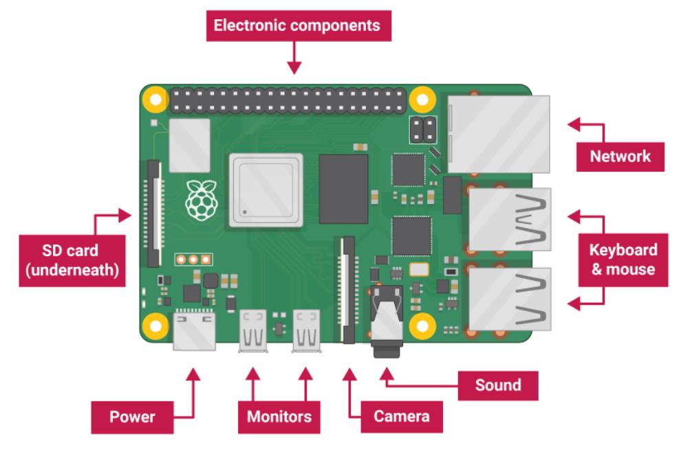

# 树莓派使用教程

## 烧录系统

我们首先下载官网提供的树莓派系统Raspbian Buster with desktop and recommended software

下载链接：<https://www.raspberrypi.org/downloads/>

选择与你系统相对应的版本

在格式化期间，存储在SD卡上的任何内容都将被覆盖。因此，如果您要安装Raspbian的SD卡上当前有任何文件，例如来自旧版本的Raspbian，您可能希望首先备份这些文件，以免永久丢失它们。 

接着我们将SD卡通过读卡器插入电脑

再打开**磁盘管理**，把SD卡对应的盘符格式化、删除所有卷，**使其变成一个整体**，再新建一个卷（这也就是所谓的“**系统分区**”），搜索“磁盘管理”即可

解压下载的系统压缩包。会出来一个.img文件。

打开Win32DiskImager工具。

工具下载地址：

<https://sourceforge.net/projects/win32diskimager/>

映像文件选择刚才的.img文件。设备选择你SD卡的对应**盘符**。点“写入”
写入完成后会提示“写入成功”。之后不管什么提示都不用管，直接拔卡插回树莓派。

将屏幕连接到Raspberry Pi 4的第一个HDMI端口（标记为HDMI0）。

您可以用同样的方式连接可选的第二个屏幕。

如果要通过有线网络将树莓派连接到internet，请使用网线将树莓派上的端口连接到墙上或internet路由器上的插座。如果要使用无线连接，或者不想连接到internet，则无需执行此操作。

如果你使用的屏幕有扬声器，声音将通过扬声器播放。或者，如果您愿意，将耳机或扬声器连接到音频端口。

将USB电源插入插座，并将其连接到Raspberry Pi的电源端口。

让你看到以下的情况时，说明树莓派已经安装完成。

树莓派官网地址：<https://www.raspberrypi.org/>