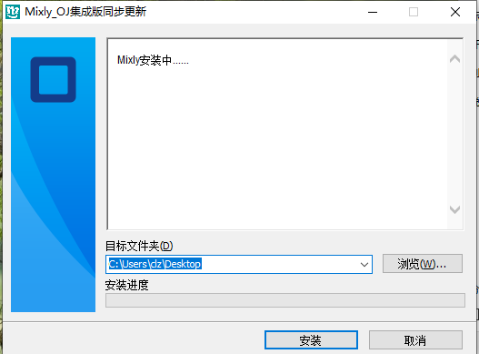
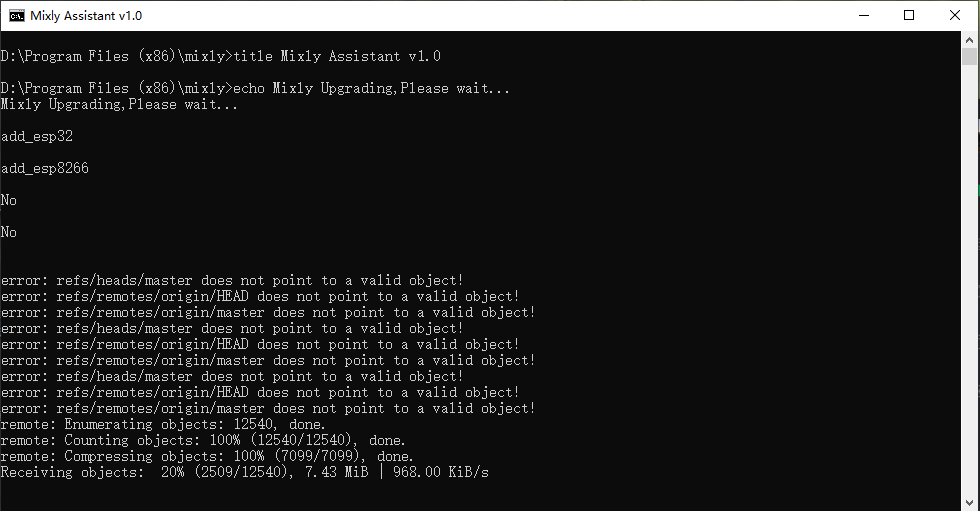
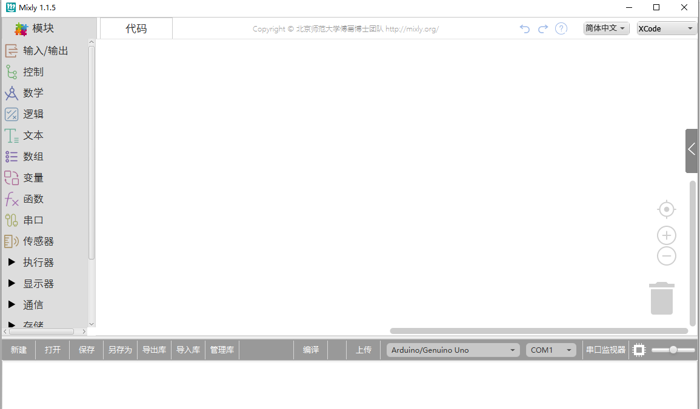

# mixly(OJ集成版)

## mixly在线安装

**优点：** 安装文件较小，电脑在联网状态下可快速下载安装包使用

**缺点：** 需要联网才能安装

**下载地址：** [mixly在线安装包](http://download.openjumper.cn/Mixly_OJ.exe)

## 下载安装方法

1、双击下载好的安装文件mixly.exe

2、选择对应的安装目录，然后点击“安装”

3、等待下载安装环境，直到安装完成（此安装过程需要电脑在联网状态）

4、安装完成后，会在桌面上自动生成快捷方式，并自动打开软件界面

