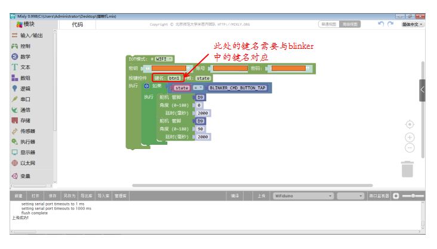

# 软件说明

## 一、下载并安装图形化编程软件

1.下载并解压 openjumper打包版本 Mixly0.998_WIN(0507）

[点击下载](https://pan.baidu.com/share/init?surl=9-VhUOC0Rt8oCJUtrbok1g)

2.双击打开Mixly.exe 打开编程软件

3.用usb数据线将主控板与电脑连接后，将主控板型号选为wifiduino（如果没有找 到wifiduino板卡选项，那么检查驱动是否安装正确。）

4.wifiduino后面端口选择，选择设备管理器里定义的端口号

## 二、编程

1、在控制栏钟拖出模式选择模块， 设置IOT模式：WIFI模式

2、 对照示例程序，拖拽编程模块。填入对应的密钥，账号，密码并将对应的程序填入按键控件内
   

   **注意：**

    1）秘钥是app中新建设备时，自动给设备分配的一个秘钥，（相当于设备的身份证）这样系统才知道是要控制哪个具体的设备。

    2）账号与密码，设备要连接路由器的账号和密码，也就是说需要将设备进行联网。这样才能云端控制和监控设备。

    3）添加的键名需要记住，后面再app中添加的按键名称一致，所以app中点击按键就会控制程序里对应按键下的动作

3、确认对应的板卡选择，和串口号选择无误后，点击上传，将程序上传到主控器里。（端口号与设备管理器里的端口号相对应）。直到提示上传成功，整个上传过程可能需要持续几分钟。