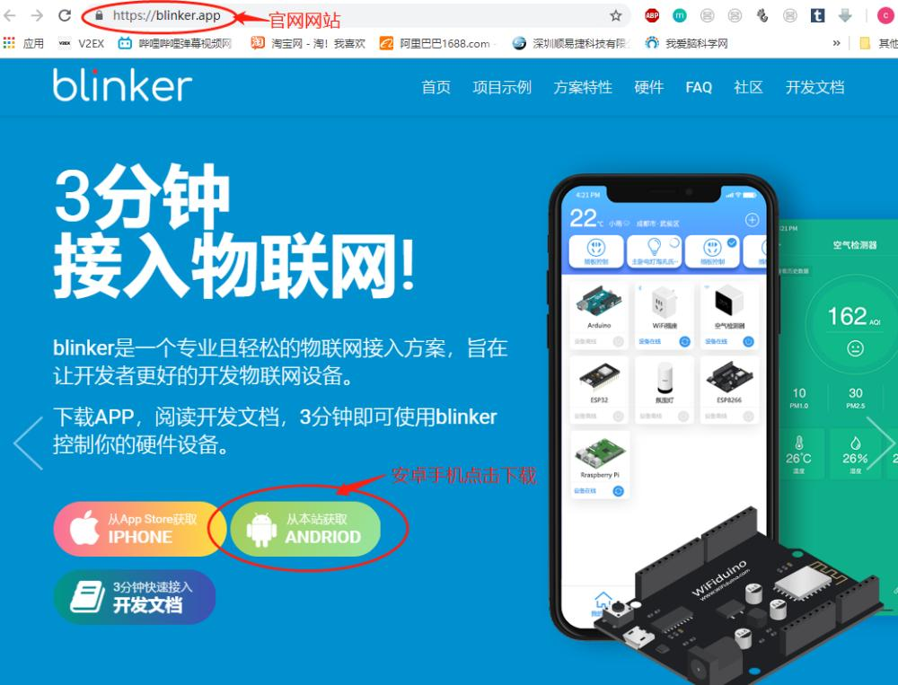
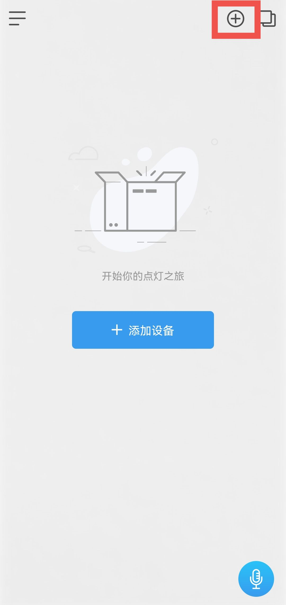
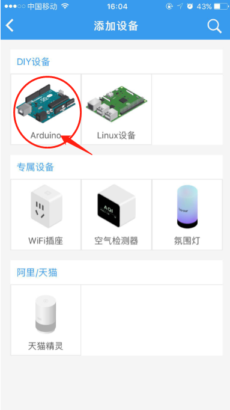
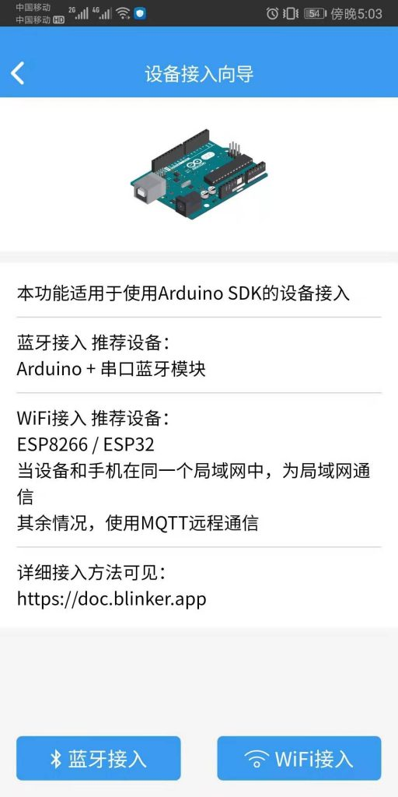
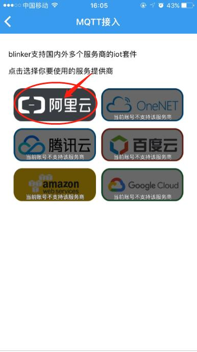
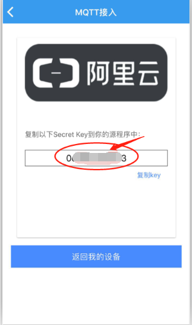
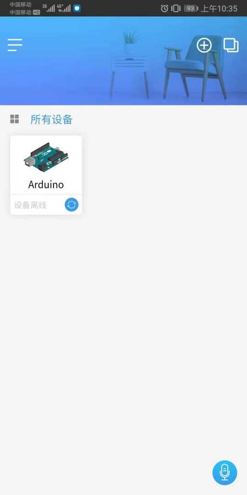

# blinker下载安装

1.ios设备（如苹果手机），app store 搜索Blinker安装即可

2.安卓设备，打开官网https://blinker.app/ 下载最新版本进行安装（华为、小米应用商店也可直接搜索安装）

1. 点击右上角+号添加设备

4.选择主控板Arduino

5.选择wifi接入

6.选择阿里云

7.密钥，主控板和平台连接的唯一识别码

8.配置完成 

