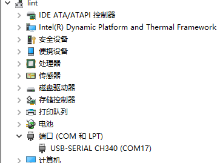

# 安装驱动

下载并安装物联网板卡驱动安装包 [esp8266_arduino_packages_2.5.2_dev.exe](http://download.openjumper.cn/8266_package_2.5.2.exe)
下载完成后，直接双击安装，将其安装在默认路径下。
注意此版本驱动安装包，如果以前有安装别的版本esp8266驱动，先卸载删除，以避免驱动不匹配，不能上传程序。

2.要给主板下载程序，还需要安装串口驱动。
[CH340驱动.rar](http://download.openjumper.cn/%E5%BC%80%E5%8F%91%E6%9D%BFUSB%E8%BD%AC%E4%B8%B2%E5%8F%A3CH340%E9%A9%B1%E5%8A%A8.zip)
下载后将其解压，然后双击运行 SETUP.EXE 文件，直到提示安装成功。

保证主板与电脑连接，进入设备管理器（右键 我的电脑 ——属性——设备管理器）找到端口（COM和LPT）。驱动安装成功后，电脑会建立一个通信端口，以便电脑与主板进行通信。如图所示：

如上图，对应的通信端口是COM17，记住这个COM17，（不同电脑可能端口号不一样）在编程下载程序的时候需要用到。