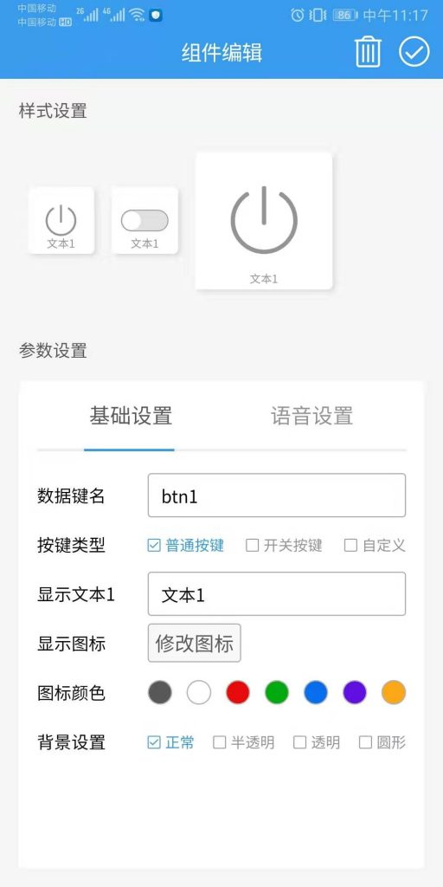
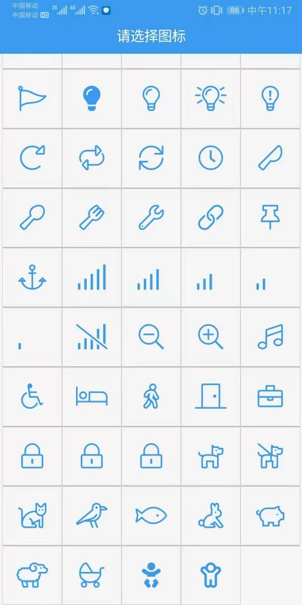
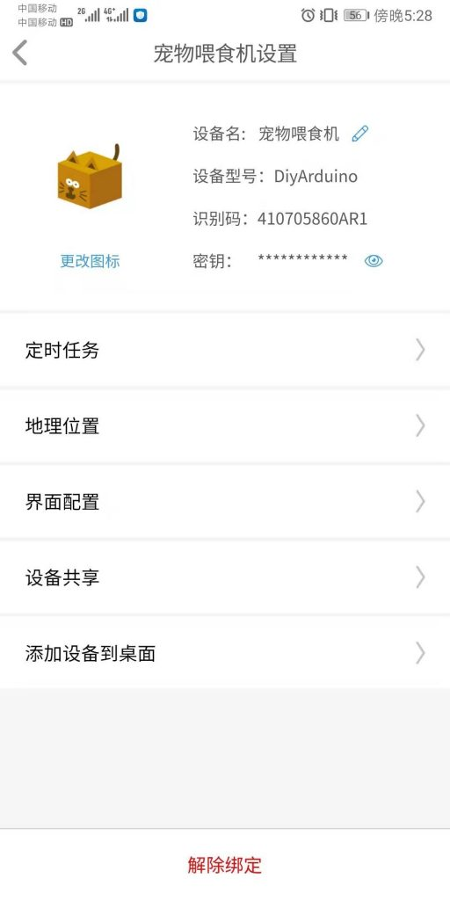

# 界面设计

1.点击设备右上角的设置，可以设置设备名称以及图片

2.再次点击设备右上角的编辑，来编辑设备的具体界面

3.下排控件选择按键 

4.根据程序中的设置输入键名 ，注意这个键名与程序里定义的名字要对应

5.点击修改图标，选择自己喜欢的图标 

6.点击右上角，选择定时任务，可以添加定时任务。定时任务与刚添加的按键是绑定在一起的。在定时任务中，可以设置一周哪些天，具体哪个时间操作按键。相当于到了定时时间会触发一次按键，而按键就给主控器发指令，控制放粮。

