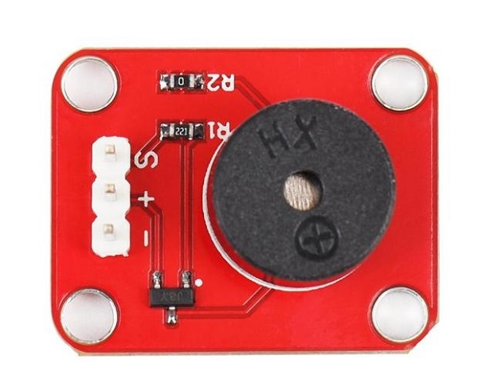
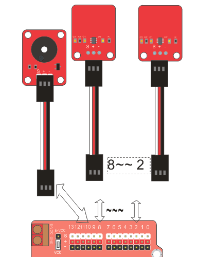
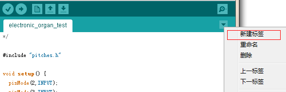
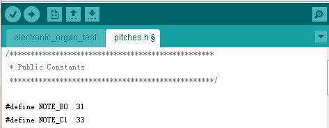
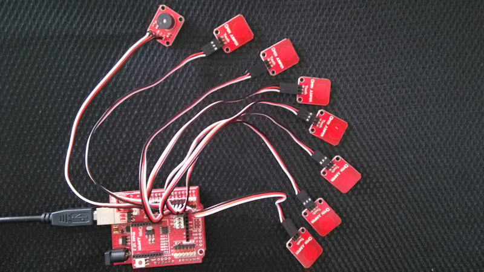

# Arduino示例教程-电子琴实验

## 概述

在此实验中，当触摸到触摸模块时模块输出高电平，松开输出低电平。利用OJ触摸模块，触发使蜂鸣器输出对应的音色。

 

 

## 元件清单

+ Zduino UNO × 1

+ OJ传感器扩展板 × 1

+ USB数据线 × 1 

+ 3p杜邦线 × 8 

+ 触摸模块 × 7

+ 蜂鸣器模块 × 1

## 知识要点

tone() 产生不同频率相同占空比(50%)的波形。

tone(pin, frequency)

tone(pin, frequency, duration)

pin: 需要输出方波的引脚

frequency: 输出的频率，unsigned int 型

duration: 频率持续的时间，单位毫秒。如果没有该参数，Arduino 将持续发出设定的音调，直到你改变发声频率或者使用noTone()函数停止发声。

## 接线示意图


7个触摸模块分别接2~8对应IO口，蜂鸣器模块对应接10号IO口。

 

## Arduino示例程序

```C++
/*
www.openjumper.cn
日期:2013.5.18
IDE 版本:1.0.1
功能：蜂鸣器+触摸模块 制作简易电子琴
奈何col
*/
#include <pitches.h>
void setup() {
  pinMode(2,INPUT);
  pinMode(3,INPUT);
  pinMode(4,INPUT);
  pinMode(5,INPUT);
  pinMode(6,INPUT);
  pinMode(7,INPUT);
  pinMode(8,INPUT);          //将2~8号IO口置为输入状态，以读取触摸模块反馈的值。
}
void loop() {
  if(digitalRead(2)){
    tone(10, NOTE_C5, 10);
  }
  if(digitalRead(3)){
    tone(10, NOTE_D5, 10);
  }
  if(digitalRead(4)){
    tone(10, NOTE_E5, 10);
  }
  if(digitalRead(5)){
    tone(10, NOTE_F5, 10);
  }
  if(digitalRead(6)){
    tone(10, NOTE_G5, 10);
  }
  if(digitalRead(7)){
    tone(10, NOTE_A5, 10);
  }
  if(digitalRead(8)){
    tone(10, NOTE_B5, 10);       //触摸到触摸模块时发出相应的音调。
  }
}
```
贴上例程后，程序还不能编译，因为缺少了一个头文件”pitches.h”，”pitches.h”里存储了我们所需音调的频率。我们需要在IED里新建这个头文件。

 

输入文件名pitches.h ，然后点击OK。

 

```
/*************************************************
 * Public Constants
 *************************************************/
#define NOTE_B0  31
#define NOTE_C1  33
#define NOTE_CS1 35
#define NOTE_D1  37
#define NOTE_DS1 39
#define NOTE_E1  41
#define NOTE_F1  44
#define NOTE_FS1 46
#define NOTE_G1  49
#define NOTE_GS1 52
#define NOTE_A1  55
#define NOTE_AS1 58
#define NOTE_B1  62
#define NOTE_C2  65
#define NOTE_CS2 69
#define NOTE_D2  73
#define NOTE_DS2 78
#define NOTE_E2  82
#define NOTE_F2  87
#define NOTE_FS2 93
#define NOTE_G2  98
#define NOTE_GS2 104
#define NOTE_A2  110
#define NOTE_AS2 117
#define NOTE_B2  123
#define NOTE_C3  131
#define NOTE_CS3 139
#define NOTE_D3  147
#define NOTE_DS3 156
#define NOTE_E3  165
#define NOTE_F3  175
#define NOTE_FS3 185
#define NOTE_G3  196
#define NOTE_GS3 208
#define NOTE_A3  220
#define NOTE_AS3 233
#define NOTE_B3  247
#define NOTE_C4  262
#define NOTE_CS4 277
#define NOTE_D4  294
#define NOTE_DS4 311
#define NOTE_E4  330
#define NOTE_F4  349
#define NOTE_FS4 370
#define NOTE_G4  392
#define NOTE_GS4 415
#define NOTE_A4  440
#define NOTE_AS4 466
#define NOTE_B4  494
#define NOTE_C5  523
#define NOTE_CS5 554
#define NOTE_D5  587
#define NOTE_DS5 622
#define NOTE_E5  659
#define NOTE_F5  698
#define NOTE_FS5 740
#define NOTE_G5  784
#define NOTE_GS5 831
#define NOTE_A5  880
#define NOTE_AS5 932
#define NOTE_B5  988
#define NOTE_C6  1047
#define NOTE_CS6 1109
#define NOTE_D6  1175
#define NOTE_DS6 1245
#define NOTE_E6  1319
#define NOTE_F6  1397
#define NOTE_FS6 1480
#define NOTE_G6  1568
#define NOTE_GS6 1661
#define NOTE_A6  1760
#define NOTE_AS6 1865
#define NOTE_B6  1976
#define NOTE_C7  2093
#define NOTE_CS7 2217
#define NOTE_D7  2349
#define NOTE_DS7 2489
#define NOTE_E7  2637
#define NOTE_F7  2794
#define NOTE_FS7 2960
#define NOTE_G7  3136
#define NOTE_GS7 3322
#define NOTE_A7  3520
#define NOTE_AS7 3729
#define NOTE_B7  3951
#define NOTE_C8  4186
#define NOTE_CS8 4435
#define NOTE_D8  4699
#define NOTE_DS8 4978
```

## 接线实物图

 

点击编译下载，连接好蜂鸣器后，便实现电子琴的制作。