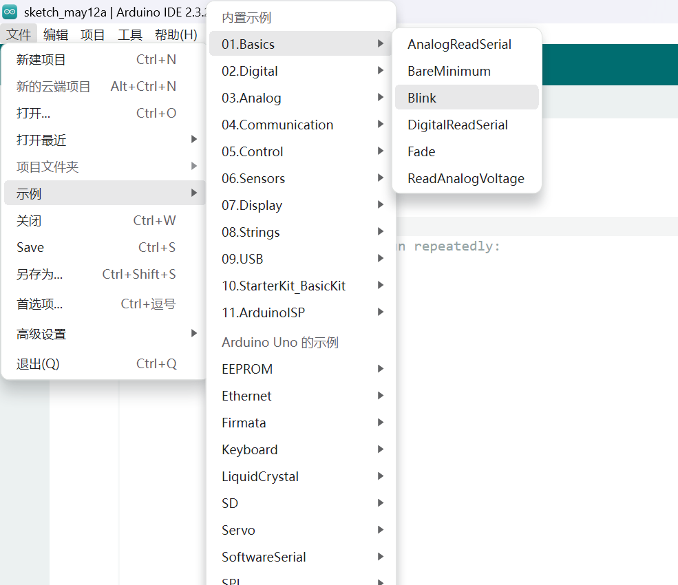
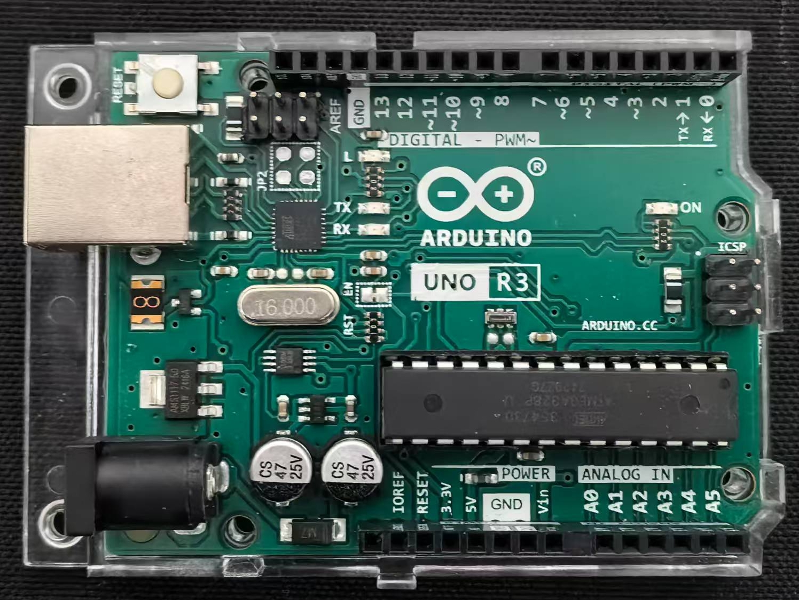
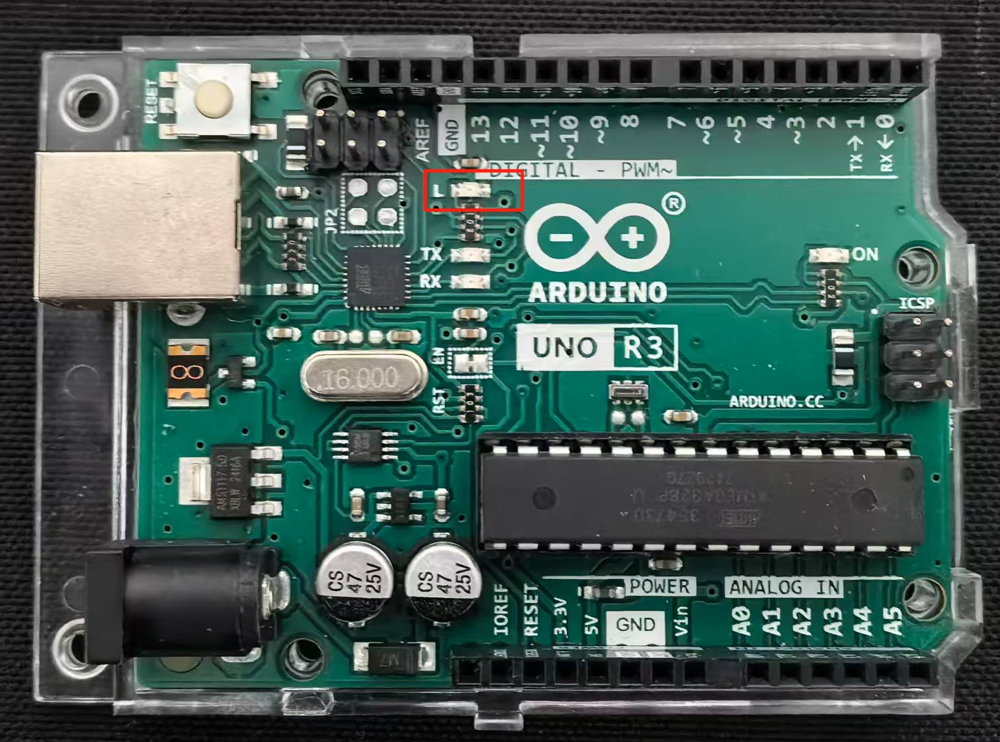

## 实验一 Hello World

Hello World是所有汇编语言的第一堂课，而Arduino中，我们的Hello World叫做Blink。Arduino提供了许多供我们学习的例程，通过学习这些例程，我们将开启一场Arduino的学习之旅，通过学习Blink，我们将打开一扇学习Arduino之旅的大门。

如图1-1，通过Arduino IDE菜单 > 文件 > 示例 > 01.Basics > Blink找到我们需要学习的例程，单击打开例程。

  

### 实物展示

  

### 硬件知识要点

  

Uno控制板的L指示灯在控制板的左上角，如图1-3所示。

### 程序编写

```arduino
/*
  Blink

  Turns on an LED on for one second, then off for one second, repeatedly.

  This example code is in the public domain.
*/

// 在大多数Arduino控制板上 13号引脚都连接了一个标有"L"的LED灯
// 我们给13号引脚设置一个别名"led"
int led = 13;

// 在板子启动或者复位重启后， setup部分的程序只会运行一次
void setup() {
  // 将"led"引脚设置为输出状态
  pinMode(led, OUTPUT);
}

// setup部分程序运行完后，loop部分的程序会不断重复运行
void loop() {
  digitalWrite(led, HIGH); // 点亮LED
  delay(1000);            // 等待一秒钟
  digitalWrite(led, LOW); // 通过将引脚电平拉低，关闭LED
  delay(1000);            // 等待一秒钟
}