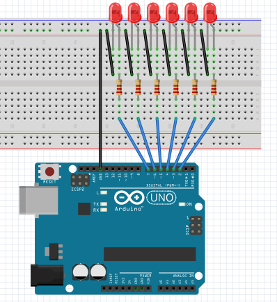
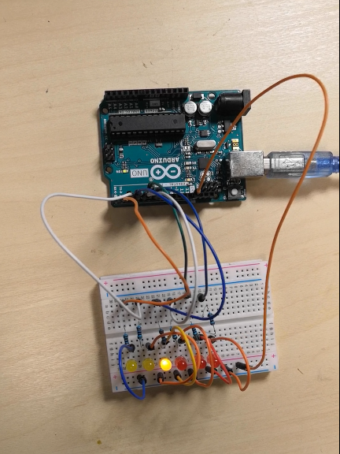

## 实验二 流水灯

在上一章中我们进行了板载LED的实验，对于Arduino的语言与Arduino IDE的使用方法有了一个简单的认识。在这一章中，我们将开始搭建第一个电路，通过流水灯实验掌握基础硬件连接和编程技巧。

---

### 实验所需材料
| 材料名称       | 数量 | 说明                          |
|----------------|------|-------------------------------|
| UNO 控制板     | 1块  | 主控设备                      |
| LED灯          | 6个  | 需区分正负极（长脚为正）      |
| 220Ω电阻       | 6个  | 限流保护LED                   |
| 面包板         | 1块  | 用于电路搭建                  |
| 面包板跳线     | 若干 | 连接电路                      |

---

### 硬件连接
1. **连接示意图**  
  

2. **实物连接图**  
  

---

### 硬件知识要点
1. **LED极性**  
   - 长脚为阳极（正极），短脚为阴极（GND）。  
   - 反接可能导致LED不工作或损坏。  

2. **限流电阻作用**  
   - LED内阻较小，直接连接高电平会烧毁。  
   - 添加220Ω电阻可限制电流，保护LED。  

3. **引脚分配**  
   - 本实验使用数字引脚2~7控制6个LED。  

---

### 程序编写
```arduino
void setup() {
  // 初始化引脚2~7为输出模式
  for(int i=2; i<8; i++) {
    pinMode(i, OUTPUT);
  }
}

void loop() {
  // 正向流水灯：引脚2→6，逐个点亮后熄灭
  for(int i=2; i<7; i++) {
    digitalWrite(i, HIGH);
    delay(1000);
    digitalWrite(i, LOW);
  }

  // 反向流水灯：引脚7→3，逐个点亮后熄灭
  for(int i=7; i>2; i--) {
    digitalWrite(i, HIGH);
    delay(1000);
    digitalWrite(i, LOW);
  }
}
```

## 程序逻辑说明
### setup()函数

初始化引脚2~7为输出模式，准备控制LED。

### loop()函数

正向流动：从引脚2到引脚6依次点亮LED，间隔1秒。

反向流动：从引脚7到引脚3依次点亮LED，间隔1秒。

循环上述过程，形成流水灯效果。