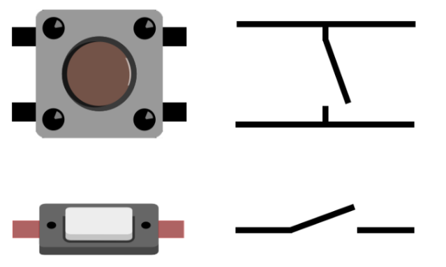
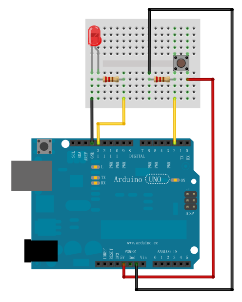
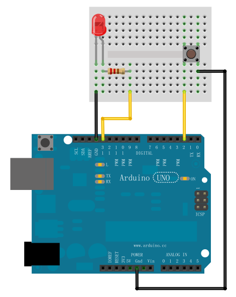
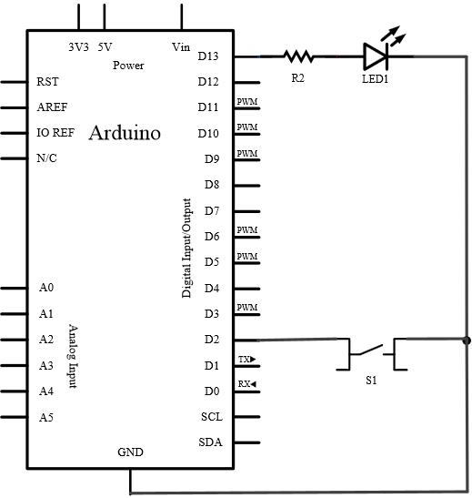

## 实验三 按键控制LED

### 实验目标
通过数字输入功能实现按键控制LED亮灭，并扩展为按键切换LED状态（按一次点亮，再按一次熄灭）。

---

### 按键原理
    

当按下按键时，就会接通按键两端，放开时，两端会再次断开

### 实验所需材料
| 材料名称       | 数量 | 说明                          |
|----------------|------|-------------------------------|
| Arduino UNO    | 1块  | 主控设备                      |
| 面包板         | 1块  | 用于电路搭建                  |
| LED            | 1个  | 需串联220Ω限流电阻            |
| 按键           | 1个  | 2脚或4脚，按下导通            |
| 220Ω电阻       | 1个  | LED限流保护                   |
| 10KΩ电阻       | 1个  | 下拉电阻（可选）              |
| 面包板跳线     | 若干 | 连接电路                      |

---

### 硬件连接与原理
#### 方案一：外部下拉电阻
1. **连接示意图**  
    
2. **原理图**  
     

**硬件知识点**：
- **限流电阻（220Ω）**：串联在LED正极，限制电流防止烧毁（LED最大承受电流约25mA）。
- **下拉电阻（10KΩ）**：连接按键与GND，稳定引脚电平。未按下时，引脚为低电平；按下时，引脚为高电平。

#### 方案二：内部上拉电阻
1. **连接示意图**  
  
  

**硬件知识点**：
- **内部上拉电阻**：通过`INPUT_PULLUP`模式启用，等效于20K~50Ω电阻连接VCC。按下按键时引脚为低电平，未按下时为高电平。

---

### 程序编写与逻辑分析
#### 基础功能：按键按下点亮LED
```arduino
const int buttonPin = 2;  // 按键连接引脚
const int ledPin = 13;    // LED连接引脚
int buttonState = 0;      // 存储按键状态

void setup() {
  pinMode(ledPin, OUTPUT);
  pinMode(buttonPin, INPUT);  // 外部下拉时使用INPUT
}

void loop() {
  buttonState = digitalRead(buttonPin);
  if (buttonState == HIGH) {  // 按键按下（高电平）
    digitalWrite(ledPin, HIGH);
  } else {                    // 按键释放（低电平）
    digitalWrite(ledPin, LOW);
  }
}
```
#### 进阶功能：按键切换LED状态
```arduino
int buttonPin = 2;
int ledPin = 13;
boolean ledState = false;  // 记录LED当前状态

void setup() {
  pinMode(buttonPin, INPUT_PULLUP);  // 启用内部上拉
  pinMode(ledPin, OUTPUT);
}

void loop() {
  while (digitalRead(buttonPin) {}  // 等待按键按下（低电平）
  
  if (ledState) {
    digitalWrite(ledPin, LOW);
  } else {
    digitalWrite(ledPin, HIGH);
  }
  ledState = !ledState;  // 切换状态
  delay(500);            // 防抖延时
}
```
### 软件知识点
####  输入模式选择：

INPUT：需外接下拉电阻。

INPUT_PULLUP：启用内部上拉电阻，按键另一端接GND。

#### 按键消抖：
通过delay(500)避免因机械抖动导致的多次触发。

#### 状态切换逻辑：
使用布尔变量ledState记录LED状态，按键按下时取反。

### 关键问题与解决方案
#### 悬空引脚问题：

未接下拉/上拉电阻时，引脚电平不稳定。

解决：外接10KΩ下拉电阻，或启用内部上拉。

#### 按键抖动：

机械按键会导致电平短暂波动。

解决：添加延时（如500ms）或使用软件消抖算法。

#### 内部上拉电阻特性：

按下时读低电平，释放时读高电平（与下拉电阻逻辑相反）。