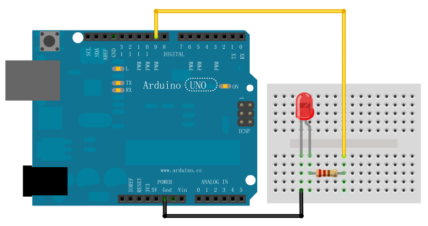
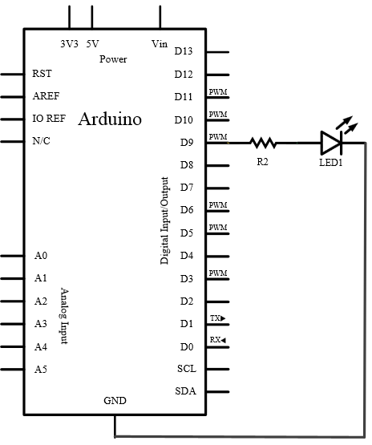

## 实验四 呼吸灯

### 实验目标
通过PWM（脉冲宽度调制）技术实现LED亮度渐变，模拟呼吸效果。

---

### 硬件配置
#### 材料清单
| 组件            | 数量 | 说明                     |
|-----------------|------|--------------------------|
| Arduino UNO     | 1    | 主控板                   |
| LED             | 1    | 需区分正负极             |
| 220Ω电阻        | 1    | 限流保护                 |
| 面包板及连接线  | 若干 | 电路搭建                 |

#### 硬件连接
1. **PWM引脚选择**  
   - 必须使用带`~`标识的PWM引脚（如D3/D5/D6/D9/D10/D11）
   - 本实验选用**D9**引脚

2. **电路示意图**  

  

原理图：

  

3. **关键要点**  
   - LED长脚（正极）接电阻后连接D9
   - 短脚（负极）接GND
   - 电阻阻值计算：`(5V-2V)/0.01A ≈ 220Ω`

---

### 核心硬件知识
1. **PWM原理**  
   - 通过快速开关（490Hz）控制平均电压
   - 占空比0%-100%对应电压0V-5V
   - 人眼感知为亮度变化

2. **引脚特性**  
   | Arduino UNO PWM引脚 | 频率  | 分辨率 |
   |---------------------|-------|--------|
   | D3, D9, D10, D11    | 490Hz | 8-bit  |
   | D5, D6              | 980Hz | 8-bit  |

---

### 程序设计
```arduino
int ledPin = 9;  // 必须使用PWM引脚

void setup() {}  // analogWrite()会自动初始化引脚

void loop() {
  // 渐亮过程（0→255）
  for(int fadeValue = 0; fadeValue <= 255; fadeValue += 5) {
    analogWrite(ledPin, fadeValue);
    delay(30);  // 调节此值改变呼吸速度
  }
  
  // 渐暗过程（255→0）
  for(int fadeValue = 255; fadeValue >= 0; fadeValue -= 5) {
    analogWrite(ledPin, fadeValue);
    delay(30);
  }
}
```

### 程序要点

#### analogWrite(pin, value)

value范围0-255（8位分辨率）

0对应0%占空比（熄灭），255对应100%（最亮）

#### 延时控制

delay(30)保证肉眼可观察渐变

减小数值加速呼吸，增大则变慢

### 常见问题
#### LED不亮

确认使用PWM引脚

检查LED极性（长脚接正极）

#### 亮度变化不平滑

减少for循环步长（如改为+=1）

增加延时时间

#### 闪烁明显

避免delay()过长（建议<50ms）

改用millis()非阻塞延时