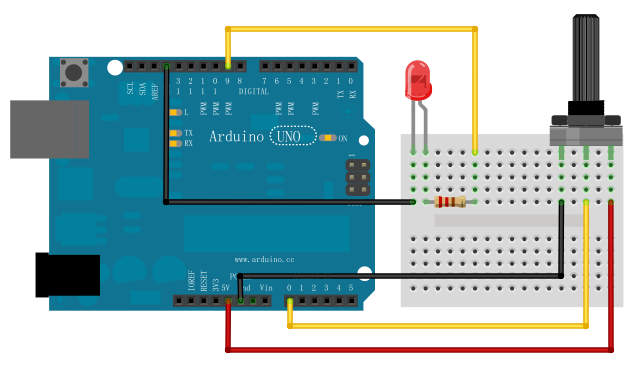
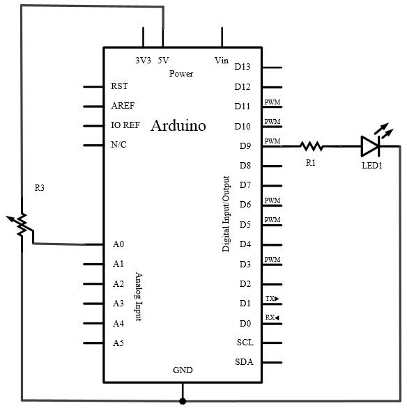
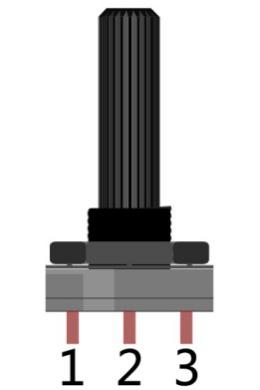

## 实验五 电位器控制呼吸灯频率

### 实验目标
通过电位器实时调节PWM呼吸灯的渐变速度，实现动态频率控制。

---

### 硬件配置
#### 材料清单
| 组件            | 数量 | 说明                     |
|-----------------|------|--------------------------|
| Arduino UNO     | 1    | 主控板                   |
| LED             | 1    | 需串联220Ω限流电阻       |
| 10KΩ电位器      | 1    | 线性旋钮式               |
| 面包板及连接线  | 若干 | 电路搭建                 |

#### 关键连接
1. **电位器接线**  
   - 1脚 → 5V  
   - 2脚 → A0（模拟输入）  
   - 3脚 → GND  

2. **LED电路**  
   - PWM引脚9 → 220Ω电阻 → LED正极  
   - LED负极 → GND  

  

### 原理图

  

---

### 核心硬件知识
1. **电位器原理**  
   - 旋钮改变内部滑动变阻器阻值（0-10KΩ）  
   - 分压公式：`Vout = 5V × (R2)/(R1+R2)`  
   - 输出电压范围：0V-5V（对应ADC值0-1023）

  
  


电位器是一个可调电阻，其原理如图所示。通过旋转旋钮改变2号脚位置，从而改变2号脚到两端的阻值。
实验中，我们需要将电位器1、3脚分别接到5V和GND，再通过模拟输入引脚读取电位器2号脚输出的电压，根据我们旋转电位器的情况，2号脚的电压会在0V至5V间变化。

2. **ADC转换特性**  
   | 参数          | 值            |
   |---------------|---------------|
   | 分辨率        | 10-bit (0-1023)|
   | 参考电压      | 5V            |
   | 转换时间      | ~100μs        |

3. **PWM引脚要求**  
   - 必须使用带`~`标识的数字引脚（如D9）

---

### 程序设计
```arduino
int ledPin = 9;    // PWM输出引脚
int potPin = A0;   // 电位器输入引脚

void setup() {}    // analogWrite/Read会自动初始化

void loop() {
  // 渐亮过程
  for(int val=0; val<=255; val+=5) {
    analogWrite(ledPin, val);
    delay(analogRead(potPin)/5);  // 动态延时控制
  }
  
  // 渐暗过程
  for(int val=255; val>=0; val-=5) {
    analogWrite(ledPin, val);
    delay(analogRead(potPin)/5);
  }
}
```

### 程序要点
#### 动态频率控制

analogRead(potPin)/5将0-1023映射到0-204ms延时

值越小呼吸频率越快（实测建议范围20-200ms）

### 

#### 故障排查
   | 现象          | 可能原因            |解决方案      |
   |---------------|---------------|-------------------|
   | LED常亮不呼吸 | 电位器未正确分压|检查电位器连线|
   | 旋钮反向控制  | 电位器1、3脚接反  | 调换电位器5v、gnd|