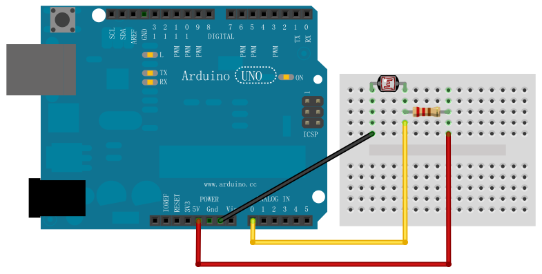
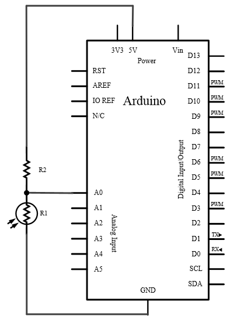
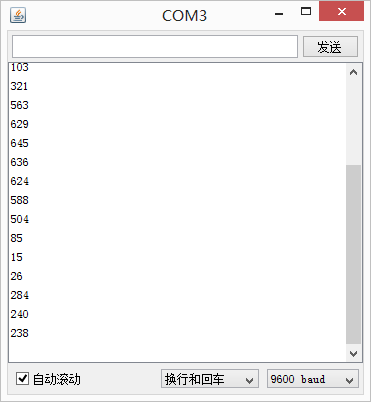

## 实验六 光敏电阻检测环境光亮度

### 实验目标
通过光敏电阻和分压电路测量环境光照强度，并通过串口输出实时数据。

---

### 硬件配置
#### 材料清单
| 组件            | 数量 | 说明                     |
|-----------------|------|--------------------------|
| Arduino UNO     | 1    | 主控板                   |
| 光敏电阻        | 1    | GL5528等常见型号         |
| 1KΩ固定电阻     | 1    | 分压电路配套电阻         |
| 面包板及连接线  | 若干 | 电路搭建                 |

#### 电路连接
1. **分压电路设计**  
   - 光敏电阻一端 → 5V  
   - 光敏电阻另一端 → A0 + 1KΩ电阻 → GND  
   - *注：光照越强，A0电压值越高*

2. **连接示意图**  
  
   *光敏电阻典型应用电路*

原理图：

  


---

### 核心硬件知识
1. **光敏电阻特性**  
  

光敏电阻: 一种电阻值随照射光强度增加而下降的电阻。

光敏电阻的使用方法很简单，将其作为一个电阻接入电路中，然后使用analogRead() 读取电压即可。由于光敏电阻阻值一般较大，直接接入电路，观察到的电压变化并不明显，所以这里我们将光敏电阻和一个普通电阻串联，根据串联分压的方法来读取到光敏电阻上的电压：

  


   | 参数          | 说明                  |
   |---------------|-----------------------|
   | 暗电阻        | 1MΩ~10MΩ（无光照）   |
   | 亮电阻        | 1KΩ~10KΩ（强光照）   |
   | 响应时间      | 20-100ms             |

2. **分压原理**  
   $$ V_{out} = 5V \times \frac{R_{固定}}{R_{光敏} + R_{固定}} $$  
   - 光照↑ → R光敏↓ → Vout↑  
   - 典型值范围：黑暗(0.1V) ~ 强光(4.5V)

3. **ADC转换对应关系**  
   | 电压   | ADC值（10-bit） |
   |--------|-----------------|
   | 0V     | 0               |
   | 2.5V   | 512             |
   | 5V     | 1023            |

---

### 程序设计
```arduino
void setup() {
  Serial.begin(9600);  // 初始化串口通信
}

void loop() {
  int lightValue = analogRead(A0);  // 读取光照强度
  
  // 串口输出数据
  Serial.print("Light ADC: ");
  Serial.println(lightValue);
  
  delay(1000);  // 1秒采样间隔
}
```
### 程序要点
#### 数据采集

analogRead()返回0-1023的ADC值

值越大表示环境越亮

#### 串口调试

Serial.begin(9600) 设置波特率

Serial.println() 自动换行输出

### 实验结果
  